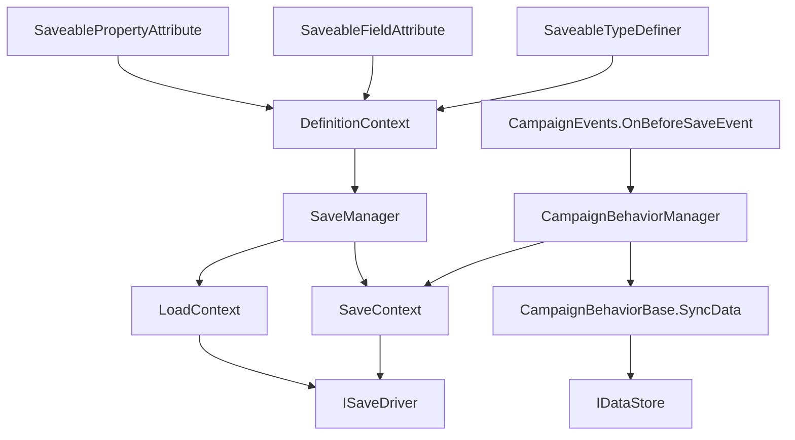

# SaveManager

**Namespace:** `TaleWorlds.SaveSystem`  
**Module:** `TaleWorlds.SaveSystem`  
**Type:** `public static class SaveManager`  
**Base:** `System.Object`  
**Source:** `bin/TaleWorlds.SaveSystem/TaleWorlds.SaveSystem/SaveManager.cs`

## 一句话职责

`SaveManager` 协调一次完整的存档或读档：收集当前程序集的保存定义、让上下文遍历根对象图，再由 `ISaveDriver` 持久化或读取数据。它不是可继承的 mod 服务，也不是给每个 Behavior 主动调用的“保存按钮”。

## 心智模型：谁拥有哪一层

把流程分成四层，才能知道代码应放在哪里：

1. **定义层。** `InitializeGlobalDefinitionContext()` 创建全局 `DefinitionContext` 并调用 `FillWithCurrentTypes()`。该扫描会实例化当前加载程序集中的非抽象 [SaveableTypeDefiner](../SaveableTypeDefiner)，先初始化每个 definer，再依次填入基本类型、类、结构、接口、枚举、根类、泛型结构、泛型类和容器定义；**容器定义完成后**才执行冲突解析器定义。
2. **对象图层。** `Save(target, ...)` 用已验证的定义构造 `SaveContext`，从 `target` 收集可保存成员和引用；`Load(...)` 则为本次操作新建定义上下文及 `LoadContext`，恢复根对象。
3. **存储层。** `ISaveDriver` 负责名称、元数据和字节数据的实际读写。`SaveManager` 将版本 1、`MetaData` 和 `SaveData` 交给它，并把成功、失败或仍在进行的状态包装为 `SaveOutput`。
4. **战役 Behavior 层。** [CampaignBehaviorManager](../../campaign/CampaignBehaviorManager) 在 `OnBeforeSave` 清空临时记录后，逐个调用 [CampaignBehaviorBase](../../campaign/CampaignBehaviorBase) 的 `SyncData(IDataStore)`；加载时再按 Behavior 的 `StringId` 回填。这才是普通战役 mod 保存私有状态的入口。

因此，**需要保存一个战役功能的小状态时**，注册 `CampaignBehaviorBase` 并使用 [IDataStore](../../campaign/IDataStore)。**需要让一个新的可达对象类型进入对象图时**，再实现 `SaveableTypeDefiner`、为成员添加 `SaveableFieldAttribute` 或 `SaveablePropertyAttribute`，并稳定保留 ID。**不应使用 `SaveManager`** 来在事件回调里自行读写战役存档；安全替代是让游戏的战役保存流程调用你的 Behavior。

## 依赖图



- **类型定义：** [SaveableTypeDefiner](../SaveableTypeDefiner) 提供类型/容器的保存 ID；[SaveableFieldAttribute](../SaveableFieldAttribute) 和 [SaveablePropertyAttribute](../SaveablePropertyAttribute) 为每个字段或属性携带 `LocalSaveId`。
- **战役桥接：** [CampaignBehaviorBase](../../campaign/CampaignBehaviorBase)、[CampaignBehaviorManager](../../campaign/CampaignBehaviorManager)、[IDataStore](../../campaign/IDataStore) 与 [CampaignEvents](../../campaign/CampaignEvents) 将 Behavior 状态送入战役根对象图。
- **同模块：** [SaveContext](../SaveContext)、[LoadContext](../LoadContext)、[ISaveDriver](../ISaveDriver)、[SaveOutput](../SaveOutput) 和 [LoadResult](../LoadResult) 分别代表收集、恢复、I/O 与结果。

## 关键成员与时机

### 初始化与检查：`InitializeGlobalDefinitionContext`、`CheckSaveableTypes`

`InitializeGlobalDefinitionContext()` 替换全局定义上下文并打印发现的定义错误。`Save(...)` 若尚未初始化会自行调用它；若上下文已有错误，保存不会开始对象图遍历，而是将每条错误转换为 `SaveError` 并返回失败的 `SaveOutput`。

`CheckSaveableTypes()` 是发布前诊断入口，但有严格的时机前提：必须在 `InitializeGlobalDefinitionContext()`（或宿主执行等价的存档系统初始化）完成后调用。它在扫描已加载程序集的实例字段和属性时会直接解引用全局 `_definitionContext`；定义上下文尚不存在时提前调用可能触发 null-reference。`Save(...)` 有缺少上下文时的延迟初始化分支，但 `CheckSaveableTypes()` 没有，因此不要把这个诊断当作启动早期探针。上下文初始化完成后，带 `SaveableFieldAttribute` 或 `SaveablePropertyAttribute`、其类型尚无定义、不是接口且有 `FullName` 的类型会被返回，并按 `Type` 去重。它**不只检查值类型**：标注字段的自定义 `LedgerState` 引用类型与 `int` 一样，若当前定义上下文不了解它，也会出现在结果中。这个结果指出“成员声明了要保存，但定义层不知道如何保存”的缺口；它不会自动注册类型，也不能修复重复的 ID。

`SaveableTypeDefiner` 的 `saveBaseId + saveId` 共同形成类型 ID；字段和属性各自的 `LocalSaveId` 也属于长期数据协议。发布后的 ID、键名或字段类型变动会使旧档解释成另一份数据，不能把它们当作可随意重排的实现细节。

### 保存：`Save`

`Save` 先将加载标志置为 false，并暂存 `MetaData` 中的应用版本。定义无误时它创建 `SaveContext`；只有 `saveContext.Save(target, metaData, out errorMessage)` 成功，才调用 `driver.Save(saveName, 1, metaData, saveContext.SaveData)`。

驱动返回 `Task<SaveResultWithMessage>`。若任务已完成，`Save` 会在自身的 `try/catch` 内读取 `task.Result`：非成功结果成为失败的 `SaveOutput`，而同步调用 `driver.Save(...)` 或这次立即读取 `Result` 抛出的异常会转换为 `GeneralFailure`。若任务尚未完成，`Save` 返回 continuing 的 `SaveOutput`；其 `ContinueWith` 之后直接读取 `t.Result.SaveResult`，没有额外的 fault 处理。因此，**返回后才 fault 的任务不会被这段 `Save` 的 catch 转换为 `GeneralFailure`**，而可能留下 faulted continuation 或未能正常填入结果。continuing 既不表示文件已落盘，也不表示异步失败已经被安全归档。操作返回前 `OperatingVersion` 会复位为空，所以它不是 mod 的版本迁移存储位。

### 加载：`LoadMetaData`、`Load`、`ShouldResolveConflicts`

`LoadMetaData` 仅委托驱动读取元数据，不会构造根对象。`Load` 在每次调用时新建并填充 `DefinitionContext`，读取 `LoadData`，再执行 `LoadContext.Load`。默认重载传入 `loadAsLateInitialize: false`；传入 true 时，成功结果附带 `LoadCallbackInitializator`，由宿主在合适阶段执行延迟初始化回调。

加载开始到返回结果之间，`ShouldResolveConflicts()` 会反映内部 `_isLoading`。这是给保存系统冲突解析使用的阶段信号，不是世界已经稳定、也不是 mod 可以对恢复中的对象执行副作用的许可。

## 真实接入示例：让战役流程保存 Behavior

以下示例不直接调用 `SaveManager.Save`。它按游戏的真实接入形状：`MBSubModuleBase.InitializeGameStarter` 取得 `CampaignGameStarter`，将 Behavior 加入启动器；随后 `CampaignBehaviorManager` 注册事件，并在保存前调用 `SyncData`。键使用带模块前缀且版本化的稳定名称。

```csharp
using TaleWorlds.CampaignSystem;
using TaleWorlds.Core;
using TaleWorlds.MountAndBlade;

public sealed class DailyLedgerBehavior : CampaignBehaviorBase
{
    private int _observedDays;

    public override void RegisterEvents()
    {
        CampaignEvents.DailyTickEvent.AddNonSerializedListener(this, OnDailyTick);
    }

    public override void SyncData(IDataStore dataStore)
    {
        dataStore.SyncData("ExampleMod.DailyLedger.ObservedDays.v1", ref _observedDays);
    }

    private void OnDailyTick()
    {
        _observedDays++;
    }
}

public sealed class ExampleModSubModule : MBSubModuleBase
{
    protected override void InitializeGameStarter(Game game, IGameStarter gameStarterObject)
    {
        if (gameStarterObject is CampaignGameStarter campaignStarter)
        {
            campaignStarter.AddBehavior(new DailyLedgerBehavior());
        }
    }
}
```

`CampaignBehaviorDataStore` 保存时将每个 Behavior 的 `SyncData` 值放入以 `StringId` 分组的记录；加载时以同一 `StringId` 查找并回填。因而 Behavior 的构造方式和存储 key 都要稳定，且不要手动多次调用 `RegisterEvents()`。

`SyncData` 接受泛型值并不代表任意对象图可序列化。上例只有 `int`，已有基本类型定义。若将字段改为自定义类、包含自定义元素的容器，或含有不可恢复的运行时句柄，必须先保证所有可达类型和容器都有定义、成员 ID 不冲突、引用在加载后仍有有效所有者。委托、UI 对象、任务、线程、临时缓存和仅在 Mission 存在的对象不应进入战役存档。

## 崩溃与坏档边界

- **缺定义不是可忽略警告。** 全局定义错误会使 `Save` 直接失败；Attribute 只标识成员，不能替代 [SaveableTypeDefiner](../SaveableTypeDefiner) 对新类型或容器的定义。
- **ID、key 与类型是兼容性契约。** 重用 `saveBaseId`/局部 ID、改写已发布的 `LocalSaveId`，或更改 `SyncData` 的稳定 key 和值类型，都会导致旧档读取错误、字段错位或无法恢复。
- **异步失败不一定被包装。** 已完成任务的 `Result` 读取和同步 `driver.Save` 调用受 `Save` 内部 catch 保护；但 continuing 任务在返回后 fault 时，`SaveOutput` 的 continuation 直接访问 `t.Result`，不由该 catch 转换为 `GeneralFailure`。不可只凭 continuing 就覆盖旧档、退出依赖该档的流程或宣称成功；宿主还必须按驱动的任务结果处理异步故障。
- **加载回调前不要改变世界。** late initialization 允许宿主推迟回调。恢复过程中创建/删除 Hero、Party、Settlement 或再次注册事件，会把不完整的引用和副作用写回后续状态。
- **不要借 `OnBeforeSave` 造对象图。** 该事件适合整理已有的标量状态；真正持久化仍应在 `SyncData` 中完成，复杂对象的定义应在保存开始前已可发现。
- **不要绕过战役保存入口。** 随机的 `ISaveDriver`、人工拼接 `MetaData` 或从事件中直接保存 `Campaign.Current` 会脱离游戏的顺序和 UI 管理，容易产生竞态或与当前保存重叠。

## 版本注记

本文依据 v1.4.5 源码。该版本的公开流程包含全局定义初始化、缺失类型检查、异步驱动结果、`LoadMetaData` 和可选 late initialization。跨版本发布时应重新检查实际源码与自己的保存协议；不要仅凭同名方法推断旧版 ID、类型定义或加载顺序兼容。

## 导航

- ↑ Parent：[存档系统索引](../)
- ↔ Sibling：[SaveableTypeDefiner](../SaveableTypeDefiner) · [SaveableFieldAttribute](../SaveableFieldAttribute) · [SaveablePropertyAttribute](../SaveablePropertyAttribute) · [SaveContext](../SaveContext) · [LoadContext](../LoadContext)
- Related：[CampaignBehaviorBase](../../campaign/CampaignBehaviorBase) · [CampaignBehaviorManager](../../campaign/CampaignBehaviorManager) · [IDataStore](../../campaign/IDataStore) · [CampaignEvents](../../campaign/CampaignEvents)
