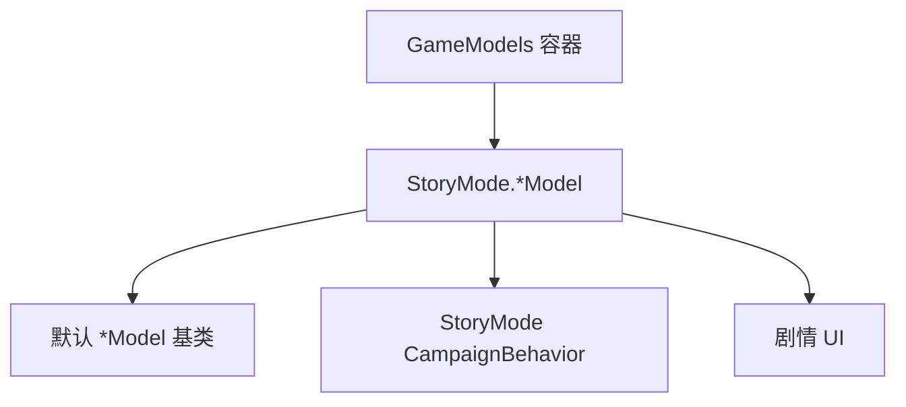

# StoryMode GameComponents 家族手册

**一句话职责：** `StoryMode.GameComponents` 是 StoryMode 主线模块对引擎 `GameModel` 体系的「剧情特化覆盖」。每个 `StoryMode*Model` 都替换或扩展某个默认 `Model`（战斗奖励、经验、工资、生成密度、目标评分……），让主线战役按剧本而非通用沙盒规则运转。它们由战役的 `GameModels` 容器在 StoryMode 激活时注册，是「改数值不改代码」的标准扩展点。

## 心智模型

把 StoryMode 想成「在默认沙盒规则外包了一层剧情数值」。游戏各处调用 `GameModels.Current.GetXxxModel()` 取模型算数值；StoryMode 启动时把自己的 `StoryMode*Model` 注册进去，从而让同一调用返回剧情值。阅读顺序：先看 [CampaignBehaviorBase](../../campaign-ext/CampaignBehaviorBase) 了解行为如何消费 `GameModels`，再看 [GUI 总索引](../../gui/_index) 了解相关 UI，最后回到本页按「战斗 / 经济 / 生成 / 剧情」四类找模型。自定义剧情数值时继承对应基类并实现 `StoryMode*Model`，不要直接改默认 `Model` 的静态字段。

## 何时使用

- 你要让主线战役的某项数值（经验、奖励、密度、评分）偏离通用规则——实现对应 `StoryMode*Model` 并注册进 `GameModels`。
- 不要修改默认 `Model` 类型本身；通过模型替换（model substitution）注入，便于回退与多模块共存。
- 模型必须是无状态/可重入的计算器；需要持久化的剧情进度应放在对应 Behavior 的 `SyncData`，而非模型字段。

## 依赖关系

- 上游：[CampaignBehaviorBase](../../campaign-ext/CampaignBehaviorBase) 与战役 `GameModels` 容器在 StoryMode 激活时注册这些模型。
- 下游：被战役行为、战斗结算、UI 调用以取得剧情数值；[GUI 总索引](../../gui/_index) 展示相关结果。
- 邻接模块：[mission-ext 总索引](../../mission-ext/_index)。

## StoryMode GameComponent 类型（StoryMode.GameComponents）

| Type | Namespace | Purpose | Timing |
| --- | --- | --- | --- |
| `StoryModeAgentDecideKilledOrUnconsciousModel` | StoryMode.GameComponents | 故事模式专用：决定战斗中 Agent 是死亡还是昏迷，覆盖默认以适配剧情。 | 战斗结算 |
| `StoryModeBanditDensityModel` | StoryMode.GameComponents | 控制地图上强盗据点/队伍的刷新密度，适配主线节奏。 | 地图生成 |
| `StoryModeBannerItemModel` | StoryMode.GameComponents | 提供剧情相关的旗帜/纹章物品数据。 | 旗帜查询 |
| `StoryModeBattleRewardModel` | StoryMode.GameComponents | 计算战斗胜利后的经验/物品/声望奖励（剧情化）。 | 战斗结束 |
| `StoryModeCombatXpModel` | StoryMode.GameComponents | 计算战斗参与者的经验获取（剧情系数）。 | 战斗结束 |
| `StoryModeCutsceneSelectionModel` | StoryMode.GameComponents | 根据剧情状态挑选应播放的过场动画。 | 剧情触发 |
| `StoryModeEncounterGameMenuModel` | StoryMode.GameComponents | 定义野外遭遇时弹出的菜单选项（剧情分支）。 | 遭遇触发 |
| `StoryModeGenericXpModel` | StoryMode.GameComponents | 处理非战斗情境（任务/事件）的经验获取。 | 经验结算 |
| `StoryModeHeroDeathProbabilityCalculationModel` | StoryMode.GameComponents | 计算剧情英雄在非战斗场景的死亡概率。 | 事件判定 |
| `StoryModeIncidentModel` | StoryMode.GameComponents | 定义与调度剧情随机事件（incident）。 | 周期触发 |
| `StoryModeKingdomDecisionPermissionModel` | StoryMode.GameComponents | 控制剧情中哪些王国决策可被玩家触发。 | 决策判定 |
| `StoryModeNotableSpawnModel` | StoryMode.GameComponents | 控制城镇要人（Notable）的刷新，适配主线。 | 城镇加载 |
| `StoryModePartySizeLimitModel` | StoryMode.GameComponents | 计算玩家/AI 队伍可带兵力上限（剧情值）。 | 编队时 |
| `StoryModePartyWageModel` | StoryMode.GameComponents | 计算部队维护工资（剧情系数）。 | 每日结算 |
| `StoryModePrisonerRecruitmentCalculationModel` | StoryMode.GameComponents | 计算俘虏转化为新兵的概率（剧情值）。 | 招募结算 |
| `StoryModeTargetScoreCalculatingModel` | StoryMode.GameComponents | 计算剧情目标（任务）的优先级评分，驱动主线推进。 | 目标评估 |
| `StoryModeTroopSupplierProbabilityModel` | StoryMode.GameComponents | 计算队伍在非战斗时补充兵员的概率。 | 周期补给 |
| `StoryModeVoiceOverModel` | StoryMode.GameComponents | 管理与剧情对应的语音/对白播放。 | 对话/过场 |

## 风险与边界

- **模型替换而非改写**：直接改默认 `Model` 静态字段会影响所有模块；应通过 `GameModels` 注册 `StoryMode*Model` 注入，便于回退。
- **无状态计算**：模型应是无状态的可重入计算器；把剧情进度塞进模型字段会在读档后丢失或错乱。
- **注册冲突**：多个模块都注册同名模型时后者覆盖前者；StoryMode 激活/停用需正确挂接与还原。
- **与默认行为不一致**：剧情数值若与默认 `Model` 差异过大，可能导致平衡崩坏或任务不可完成，需配合任务设计校验。

## 参见

- 模型消费方：[CampaignBehaviorBase](../../campaign-ext/CampaignBehaviorBase)
- 相关 UI：[GUI 总索引](../../gui/_index)
- 行为上层：[mission-ext 总索引](../../mission-ext/_index)
