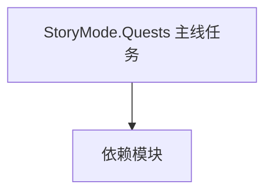

# StoryMode.Quests 主线任务

**一句话职责：** 本页以家族索引形式覆盖 `StoryMode.Quests 主线任务` 下全部 38 个业务类型，逐类给出命名空间、职责与典型时机，便于按模块而不是按字母表查阅。

## 心智模型

StoryMode.Quests 是主线剧情的任务定义，按阶段（FirstPhase/SecondPhase/TutorialPhase/ThirdPhase/PlayerClanQuests）组织。每个 Quest 派生类声明任务的目标、对话触发、完成条件与奖励，由 QuestManager 在剧情推进时激活。它与 CampaignBehavior 协作驱动叙事，但不直接写规则。

## 何时使用

扩展或新增主线任务阶段时，继承对应 Quest 基类并在 QuestManager 注册；任务流转通过事件与 Behavior 联动。

## 依赖关系

`StoryMode.Quests 主线任务` 的类型依赖以下模块；缺其中任一都会导致编译或运行期失败。

- [Campaign 战役](../../campaign/Campaign)
- [StoryMode 总览](../_index)
- [CampaignBehaviorBase](../../campaign-ext/CampaignBehaviorBase)

## 类型清单

| Type | Namespace | Purpose | Timing |
| --- | --- | --- | --- |
| `ArzagosBannerPieceQuest` | StoryMode.Quests.FirstPhase | 剧情任务相关类型，定义任务阶段与流程 | 剧情推进期 |
| `AssembleTheBannerQuest` | StoryMode.Quests.FirstPhase | 剧情任务相关类型，定义任务阶段与流程 | 剧情推进期 |
| `BannerInvestigationQuest` | StoryMode.Quests.FirstPhase | 剧情任务相关类型，定义任务阶段与流程 | 剧情推进期 |
| `CreateKingdomQuest` | StoryMode.Quests.FirstPhase | 剧情任务相关类型，定义任务阶段与流程 | 剧情推进期 |
| `HideoutBattleEndState` | StoryMode.Quests.FirstPhase | 剧情任务相关类型，定义任务阶段与流程 | 剧情推进期 |
| `IstianasBannerPieceQuest` | StoryMode.Quests.FirstPhase | 剧情任务相关类型，定义任务阶段与流程 | 剧情推进期 |
| `MeetWithArzagosQuest` | StoryMode.Quests.FirstPhase | 剧情任务相关类型，定义任务阶段与流程 | 剧情推进期 |
| `MeetWithIstianaQuest` | StoryMode.Quests.FirstPhase | 剧情任务相关类型，定义任务阶段与流程 | 剧情推进期 |
| `SupportKingdomQuest` | StoryMode.Quests.FirstPhase | 剧情任务相关类型，定义任务阶段与流程 | 剧情推进期 |
| `RebuildPlayerClanQuest` | StoryMode.Quests.PlayerClanQuests | 剧情任务相关类型，定义任务阶段与流程 | 剧情推进期 |
| `RebuildPlayerClanQuestBehaviorTypeDefiner` | StoryMode.Quests.PlayerClanQuests | 存档类型定义器，声明该类型的序列化结构 | 剧情推进期 |
| `RescueFamilyQuest` | StoryMode.Quests.PlayerClanQuests | 剧情任务相关类型，定义任务阶段与流程 | 剧情推进期 |
| `RescueFamilyQuestBehavior` | StoryMode.Quests.PlayerClanQuests | 战役系统行为，监听全局事件驱动该系统的初始化与周期更新 | 剧情推进期 |
| `PurchaseItemTutorialQuestTask` | StoryMode.Quests.QuestTasks | 剧情任务相关类型，定义任务阶段与流程 | 剧情推进期 |
| `RecruitTroopTutorialQuestTask` | StoryMode.Quests.QuestTasks | 剧情任务相关类型，定义任务阶段与流程 | 剧情推进期 |
| `AssembleEmpireQuest` | StoryMode.Quests.SecondPhase | 剧情任务相关类型，定义任务阶段与流程 | 剧情推进期 |
| `AssembleEmpireQuestBehavior` | StoryMode.Quests.SecondPhase | 战役系统行为，监听全局事件驱动该系统的初始化与周期更新 | 剧情推进期 |
| `AssembleEmpireQuestBehaviorTypeDefiner` | StoryMode.Quests.SecondPhase | 存档类型定义器，声明该类型的序列化结构 | 剧情推进期 |
| `ConspiracyProgressQuest` | StoryMode.Quests.SecondPhase | 剧情任务相关类型，定义任务阶段与流程 | 剧情推进期 |
| `ConspiracyQuestBase` | StoryMode.Quests.SecondPhase | 剧情任务相关类型，定义任务阶段与流程 | 剧情推进期 |
| `WeakenEmpireQuest` | StoryMode.Quests.SecondPhase | 剧情任务相关类型，定义任务阶段与流程 | 剧情推进期 |
| `WeakenEmpireQuestBehavior` | StoryMode.Quests.SecondPhase | 战役系统行为，监听全局事件驱动该系统的初始化与周期更新 | 剧情推进期 |
| `WeakenEmpireQuestBehaviorTypeDefiner` | StoryMode.Quests.SecondPhase | 存档类型定义器，声明该类型的序列化结构 | 剧情推进期 |
| `ConspiracyBaseOfOperationsDiscoveredConspiracyQuest` | StoryMode.Quests.SecondPhase.ConspiracyQuests | 剧情任务相关类型，定义任务阶段与流程 | 剧情推进期 |
| `DestroyRaidersConspiracyQuest` | StoryMode.Quests.SecondPhase.ConspiracyQuests | 剧情任务相关类型，定义任务阶段与流程 | 剧情推进期 |
| `DisruptSupplyLinesConspiracyQuest` | StoryMode.Quests.SecondPhase.ConspiracyQuests | 剧情任务相关类型，定义任务阶段与流程 | 剧情推进期 |
| `DefeatTheConspiracyQuest` | StoryMode.Quests.ThirdPhase | 剧情任务相关类型，定义任务阶段与流程 | 剧情推进期 |
| `DefeatTheConspiracyQuestBehavior` | StoryMode.Quests.ThirdPhase | 战役系统行为，监听全局事件驱动该系统的初始化与周期更新 | 剧情推进期 |
| `DefeatTheConspiracyQuestBehaviorTypeDefiner` | StoryMode.Quests.ThirdPhase | 存档类型定义器，声明该类型的序列化结构 | 剧情推进期 |
| `OppositionData` | StoryMode.Quests.ThirdPhase | 剧情任务相关类型，定义任务阶段与流程 | 剧情推进期 |
| `FindHideoutTutorialQuest` | StoryMode.Quests.TutorialPhase | 剧情任务相关类型，定义任务阶段与流程 | 剧情推进期 |
| `HideoutBattleEndState` | StoryMode.Quests.TutorialPhase | 剧情任务相关类型，定义任务阶段与流程 | 剧情推进期 |
| `LocateAndRescueTravellerTutorialQuest` | StoryMode.Quests.TutorialPhase | 剧情任务相关类型，定义任务阶段与流程 | 剧情推进期 |
| `PurchaseGrainTutorialQuest` | StoryMode.Quests.TutorialPhase | 剧情任务相关类型，定义任务阶段与流程 | 剧情推进期 |
| `RecruitTroopsTutorialQuest` | StoryMode.Quests.TutorialPhase | 剧情任务相关类型，定义任务阶段与流程 | 剧情推进期 |
| `TalkToTheHeadmanTutorialQuest` | StoryMode.Quests.TutorialPhase | 剧情任务相关类型，定义任务阶段与流程 | 剧情推进期 |
| `TravelToVillageTutorialQuest` | StoryMode.Quests.TutorialPhase | 剧情任务相关类型，定义任务阶段与流程 | 剧情推进期 |
| `VillagersInNeed` | StoryMode.Quests.TutorialPhase | 剧情任务相关类型，定义任务阶段与流程 | 剧情推进期 |

## 风险与边界

任务条件判定要幂等，重复触发会导致奖励翻倍或状态错乱。跨阶段任务需注意存档兼容——新增字段必须带默认值，否则旧档反序列化失败。

## 参见

- [Campaign 战役](../../campaign/Campaign)
- [StoryMode 总览](../_index)
- [CampaignBehaviorBase](../../campaign-ext/CampaignBehaviorBase)
