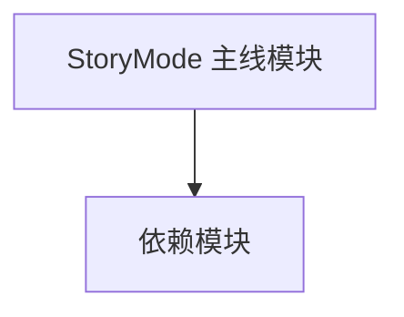

# StoryMode 主线模块类型

**一句话职责：** 本页以家族索引形式覆盖 `StoryMode` 命名空间下、除 Quests 子页已收录外的全部 63 个业务类型，逐类给出命名空间、职责与典型时机。

## 心智模型

StoryMode 是 Bannerlord 主线叙事模块：它在 SandBox 战役框架之上叠加剧情驱动层——任务（Quest）、阶段（Phase）、剧情界面与扩展工具。这些类型本身不写核心规则，而是通过监听 Campaign 事件、与 CampaignBehavior 协作来推进叙事；存档兼容性由各自字段的默认值保证。

## 何时使用

需要扩展或新增主线内容（新任务阶段、剧情界面、扩展方法）时，从对应基类派生，并在 QuestManager / CampaignBehavior 中注册；不要在主线程逻辑里硬编码剧情流转。

## 依赖关系

`StoryMode` 类型依赖战役与任务框架；缺其中任一都会导致编译或运行期失败。

- [Campaign 战役](../../campaign/Campaign)
- [CampaignBehaviorBase 行为基类](../../campaign-ext/CampaignBehaviorBase)
- [Quests 主线任务](./Quests/_index)
- [GameComponents 剧情组件](./GameComponents/_index)

## 类型清单

| Type | Namespace | Purpose | Timing |
| --- | --- | --- | --- |
| `CampaignStoryMode` | StoryMode | StoryMode 模块业务类型，参与主线叙事与界面 | 运行期 |
| `ConspiracyQuestMapNotification` | StoryMode | 主线/支线任务定义，声明目标、触发与完成条件，由 QuestManager 在剧情推进时激活 | 运行期 |
| `IsArzagosTag` | StoryMode | StoryMode 模块业务类型，参与主线叙事与界面 | 运行期 |
| `IsIstianaTag` | StoryMode | StoryMode 模块业务类型，参与主线叙事与界面 | 运行期 |
| `IsStoryModeMentorTag` | StoryMode | StoryMode 模块业务类型，参与主线叙事与界面 | 运行期 |
| `MainStoryLine` | StoryMode | StoryMode 模块业务类型，参与主线叙事与界面 | 运行期 |
| `MainStoryLineSide` | StoryMode | StoryMode 模块业务类型，参与主线叙事与界面 | 运行期 |
| `SaveableStoryModeTypeDefiner` | StoryMode | StoryMode 模块业务类型，参与主线叙事与界面 | 运行期 |
| `StoryModeCheats` | StoryMode | StoryMode 模块业务类型，参与主线叙事与界面 | 运行期 |
| `StoryModeData` | StoryMode | StoryMode 模块业务类型，参与主线叙事与界面 | 运行期 |
| `StoryModeEvents` | StoryMode | StoryMode 模块业务类型，参与主线叙事与界面 | 运行期 |
| `StoryModeHelpers` | StoryMode | StoryMode 模块业务类型，参与主线叙事与界面 | 运行期 |
| `StoryModeManager` | StoryMode | StoryMode 模块业务类型，参与主线叙事与界面 | 运行期 |
| `StoryModeQuestBase` | StoryMode | 主线/支线任务定义，声明目标、触发与完成条件，由 QuestManager 在剧情推进时激活 | 运行期 |
| `StoryModeSubModule` | StoryMode | StoryMode 模块业务类型，参与主线叙事与界面 | 运行期 |
| `TrainingField` | StoryMode | StoryMode 模块业务类型，参与主线叙事与界面 | 运行期 |
| `TrainingFieldEncounter` | StoryMode | StoryMode 模块业务类型，参与主线叙事与界面 | 运行期 |
| `Extensions` | StoryMode.Extensions | 扩展方法/静态工具类型，为宿主类型追加便捷能力 | 调用时 |
| `MetaDataExtensions` | StoryMode.Extensions | 扩展方法/静态工具类型，为宿主类型追加便捷能力 | 调用时 |
| `AchievementsCampaignBehavior` | StoryMode.GameComponents.CampaignBehaviors | 战役系统行为，监听全局事件驱动剧情相关系统的更新 | 运行期 |
| `FirstPhaseCampaignBehavior` | StoryMode.GameComponents.CampaignBehaviors | 战役系统行为，监听全局事件驱动剧情相关系统的更新 | 运行期 |
| `LordConversationsStoryModeBehavior` | StoryMode.GameComponents.CampaignBehaviors | 战役系统行为，监听全局事件驱动剧情相关系统的更新 | 运行期 |
| `MainStorylineCampaignBehavior` | StoryMode.GameComponents.CampaignBehaviors | 战役系统行为，监听全局事件驱动剧情相关系统的更新 | 运行期 |
| `SecondPhaseCampaignBehavior` | StoryMode.GameComponents.CampaignBehaviors | 战役系统行为，监听全局事件驱动剧情相关系统的更新 | 运行期 |
| `StoryModeBanditSpawnCampaignBehavior` | StoryMode.GameComponents.CampaignBehaviors | 战役系统行为，监听全局事件驱动剧情相关系统的更新 | 运行期 |
| `StoryModeCharacterCreationCampaignBehavior` | StoryMode.GameComponents.CampaignBehaviors | 战役系统行为，监听全局事件驱动剧情相关系统的更新 | 运行期 |
| `StoryModeTutorialBoxCampaignBehavior` | StoryMode.GameComponents.CampaignBehaviors | 战役系统行为，监听全局事件驱动剧情相关系统的更新 | 运行期 |
| `ThirdPhaseCampaignBehavior` | StoryMode.GameComponents.CampaignBehaviors | 战役系统行为，监听全局事件驱动剧情相关系统的更新 | 运行期 |
| `TrainingFieldCampaignBehavior` | StoryMode.GameComponents.CampaignBehaviors | 战役系统行为，监听全局事件驱动剧情相关系统的更新 | 运行期 |
| `TutorialPhaseCampaignBehavior` | StoryMode.GameComponents.CampaignBehaviors | 战役系统行为，监听全局事件驱动剧情相关系统的更新 | 运行期 |
| `StoryModeGauntletUISubModule` | StoryMode.GauntletUI | StoryMode 模块业务类型，参与主线叙事与界面 | 运行期 |
| `GauntletStoryModeMapCheatsView` | StoryMode.GauntletUI.Map | StoryMode 模块业务类型，参与主线叙事与界面 | 运行期 |
| `MissionGauntletTrainingFieldObjectiveView` | StoryMode.GauntletUI.Missions | 剧情任务相关类型，参与任务流程与阶段流转 | 任务加载时 |
| `DelayedAction` | StoryMode.Missions | 剧情任务相关类型，参与任务流程与阶段流转 | 任务加载时 |
| `MouseObjectives` | StoryMode.Missions | 剧情任务相关类型，参与任务流程与阶段流转 | 任务加载时 |
| `ObjectivePerformingType` | StoryMode.Missions | 剧情任务相关类型，参与任务流程与阶段流转 | 任务加载时 |
| `StoryModeMissions` | StoryMode.Missions | 剧情任务相关类型，参与任务流程与阶段流转 | 任务加载时 |
| `TrainingFieldMissionController` | StoryMode.Missions | 剧情任务相关类型，参与任务流程与阶段流转 | 任务加载时 |
| `TutorialObjective` | StoryMode.Missions | 剧情任务相关类型，参与任务流程与阶段流转 | 任务加载时 |
| `StoryModeBannerEffects` | StoryMode.StoryModeObjects | StoryMode 模块业务类型，参与主线叙事与界面 | 运行期 |
| `StoryModeHeroes` | StoryMode.StoryModeObjects | StoryMode 模块业务类型，参与主线叙事与界面 | 运行期 |
| `FirstPhase` | StoryMode.StoryModePhases | 剧情阶段定义，描述该阶段的目标、入场与结束条件 | 剧情阶段切换时 |
| `SecondPhase` | StoryMode.StoryModePhases | 剧情阶段定义，描述该阶段的目标、入场与结束条件 | 剧情阶段切换时 |
| `ThirdPhase` | StoryMode.StoryModePhases | 剧情阶段定义，描述该阶段的目标、入场与结束条件 | 剧情阶段切换时 |
| `TutorialPhase` | StoryMode.StoryModePhases | 剧情阶段定义，描述该阶段的目标、入场与结束条件 | 剧情阶段切换时 |
| `TutorialQuestPhase` | StoryMode.StoryModePhases | 主线/支线任务定义，声明目标、触发与完成条件，由 QuestManager 在剧情推进时激活 | 剧情阶段切换时 |
| `StoryModeViewCreator` | StoryMode.View | StoryMode 模块业务类型，参与主线叙事与界面 | 运行期 |
| `StoryModeViewSubModule` | StoryMode.View | StoryMode 模块业务类型，参与主线叙事与界面 | 运行期 |
| `StealthTutorialMarkerProvider` | StoryMode.View.MarkerProviders | 剧情任务相关类型，参与任务流程与阶段流转 | 运行期 |
| `MissionTrainingFieldObjectiveView` | StoryMode.View.Missions | 剧情任务相关类型，参与任务流程与阶段流转 | 任务加载时 |
| `StealthTutorialView` | StoryMode.View.Missions | 剧情任务相关类型，参与任务流程与阶段流转 | 任务加载时 |
| `StoryModeMissionViews` | StoryMode.View.Missions | 剧情任务相关类型，参与任务流程与阶段流转 | 任务加载时 |
| `StoryModePermissionsSystem` | StoryMode.View.Permissions | 剧情任务相关类型，参与任务流程与阶段流转 | 任务加载时 |
| `ConspiracyQuestMapNotificationItemVM` | StoryMode.ViewModelCollection.Map | 主线/支线任务定义，声明目标、触发与完成条件，由 QuestManager 在剧情推进时激活 | 运行期 |
| `ControllerStickInput` | StoryMode.ViewModelCollection.Missions | 剧情任务相关类型，参与任务流程与阶段流转 | 任务加载时 |
| `InputTypes` | StoryMode.ViewModelCollection.Missions | 剧情任务相关类型，参与任务流程与阶段流转 | 任务加载时 |
| `KeyInput` | StoryMode.ViewModelCollection.Missions | 剧情任务相关类型，参与任务流程与阶段流转 | 任务加载时 |
| `MouseAndClickInput` | StoryMode.ViewModelCollection.Missions | 剧情任务相关类型，参与任务流程与阶段流转 | 任务加载时 |
| `MouseClickTypes` | StoryMode.ViewModelCollection.Missions | 剧情任务相关类型，参与任务流程与阶段流转 | 任务加载时 |
| `MovementTypes` | StoryMode.ViewModelCollection.Missions | 剧情任务相关类型，参与任务流程与阶段流转 | 任务加载时 |
| `TrainingFieldObjectiveItemVM` | StoryMode.ViewModelCollection.Missions | 剧情任务相关类型，参与任务流程与阶段流转 | 任务加载时 |
| `TrainingFieldObjectivesVM` | StoryMode.ViewModelCollection.Missions | 剧情任务相关类型，参与任务流程与阶段流转 | 任务加载时 |
| `TrainingObjectiveKeyVM` | StoryMode.ViewModelCollection.Missions | 剧情任务相关类型，参与任务流程与阶段流转 | 任务加载时 |

## 风险与边界

剧情类型多为可序列化状态，新增字段必须带默认值以免旧档反序列化失败；任务/阶段条件判定要幂等，重复触发不得重复结算奖励。扩展方法（Extensions）只应提供便利封装，不持有状态。

## 参见

- [Campaign 战役](../../campaign/Campaign)
- [CampaignBehaviorBase 行为基类](../../campaign-ext/CampaignBehaviorBase)
- [Quests 主线任务](./Quests/_index)
- [GameComponents 剧情组件](./GameComponents/_index)
- [API 总览](../_index)
