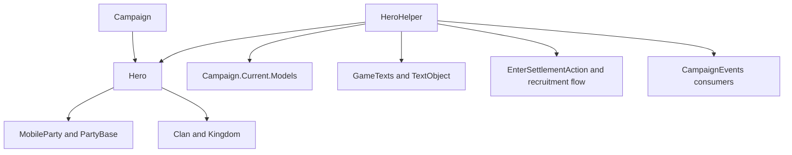

# HeroHelper

**命名空间：** `Helpers`  
**模块：** `TaleWorlds.CampaignSystem`  
**类型：** `public static class HeroHelper`  
**基类：** `System.Object`  
**源文件：** `bin/TaleWorlds.CampaignSystem/Helpers/HeroHelper.cs`

## 一句话职责

这个静态类把英雄的当前位置、对话文本、招募资格、关系倾向和若干创建时辅助计算集中到 Campaign 层，供战役行为、Action 和 UI 复用；它读取已注册的 `Hero`、`MobileParty`、`Settlement` 与当前 Model，返回即时计算结果，并明确区分只读查询和会触发首次入场状态变更的专用入口。

## 心智模型

`HeroHelper` 没有实例、没有自己的生命周期，也不是英雄数据的所有者。它是建立在已注册 [Hero](../../campaign/Hero) 与当前 [Campaign](../../campaign/Campaign) 之上的一组规则函数：大多数入口只读英雄、派对、阵营和 Model，少数入口会通过 Action 或 roster 改变世界。

使用边界很重要：

- 查询英雄的最近据点、最后出现文本、职业文本、默认关系或队伍归属时，可以调用对应 helper；返回值反映调用时的 Campaign 状态，不是可保存的快照。
- `GetVolunteerTroopsOfHeroForRecruitment`、`HeroCanRecruitFromHero` 和 `StartRecruitingMoneyLimit*` 只提供招募计算。真正把英雄、兵种或金币写入世界，仍应走 [AddHeroToPartyAction](../../campaign-ext/AddHeroToPartyAction)、招募流程或相应 Action。
- `SpawnHeroForTheFirstTime` 是例外：它设置出生据点、调用 `EnterSettlementAction.ApplyForCharacterOnly`，再把英雄设为 Active。它只适用于尚未进入战役的特定英雄，不是把现有英雄“传送”到据点的 API。
- `SetPlayerSalutation`、`WillLordAttack` 和 `LordWillConspireWithLord` 依赖当前对话/遭遇上下文。它们不是后台线程或主菜单阶段的通用判断器。

## 依赖图



| 依赖 | 作用与时机 |
| --- | --- |
| [Campaign](../../campaign/Campaign) | 提供 `Campaign.Current`、地图距离、ConversationManager、Model 和对象集合；多数位置、关系与招募入口都要求 Campaign 已启动。 |
| [Hero](../../campaign/Hero) 与 [CharacterObject](../../campaign/CharacterObject) | Hero 承载具体战役人物；CharacterObject 提供模板、文化和 `StringId`。helper 不创建替代对象。 |
| [MobileParty](../../campaign/MobileParty)、[PartyBase](../../campaign/PartyBase)、[Settlement](../../campaign/Settlement) | `GetClosestSettlement`、`UnderPlayerCommand`、招募和玩家队伍排序会从这些宿主读取即时关系。 |
| `Campaign.Current.Models` | `DefaultRelation` 使用 AgeModel，英雄排序使用 EncounterModel，招募上限使用 VolunteerModel；helper 不是这些 Model 的替代品。 |
| [EnterSettlementAction](../../campaign-ext/EnterSettlementAction) | `SpawnHeroForTheFirstTime` 的世界变更部分由它完成；不要只调用 helper 的一半逻辑。 |
| [CampaignEvents](../../campaign/CampaignEvents) 与 Behavior | helper 自己不发布一套新的公共事件；需要持久化或通知其他系统时，使用对应 Action/Behavior 的完整流程。 |

## 主要入口与调用边界

### 位置、文本与职业

| 入口 | 实际行为 | 使用时机 |
| --- | --- | --- |
| `GetClosestSettlement(Hero)` | 优先当前据点，再从英雄所属队伍、囚禁方或玩家遭遇推导最近的村庄/要塞；若得到的据点不是村庄/要塞，会再次寻找符合条件的据点。可能返回 `null`。 | 地图标记、AI 或 UI 需要一个近似位置时调用；不要把结果当作英雄永久所在地。 |
| `GetLastSeenText(Hero)` | 根据 `LastKnownClosestSettlement` 选择“从未见过”或“最后出现”文本，并设置据点和是否仍在该据点的变量。 | 百科、通知和 tooltip；需要有效的 `GameTexts`/本地化上下文。 |
| `GetTitleInIndefiniteCase(Hero)`、`GetCharacterTypeName(Hero)` | 按文化、性别、王国领袖身份、职业和阵营返回本地化标题/职业名。未知职业会返回 unknown 文本。 | 只读展示；不要用本地化文本反推 Hero 的类型。 |
| `GetOccupiedEventReasonText(Hero)` | 根据 `CanHaveCampaignIssues()` 区分忙于 issue/quest 和一般忙碌。 | 展示不能发起事件的原因；真实资格仍由对应系统重新判断。 |
| `SetPropertiesToTextObject(Hero/Settlement, TextObject, string)` | 把角色或据点属性填入指定文本 tag；它只准备文本变量，不改变 Hero/Settlement。 | 在已有文本对象上填充 `OWNER` 等变量时调用。 |

### 关系、对话与玩家队伍

| 入口 | 实际行为 | 风险 |
| --- | --- | --- |
| `UnderPlayerCommand(Hero)`、`IsCompanionInPlayerParty(Hero)` | 分别判断英雄是否属于玩家直接控制范围、以及玩家同伴是否实际在主队伍中；空 Hero 会安全返回 false。 | “属于玩家阵营”不等于“在主队伍”；不要用它代替 `PartyBelongedTo` 或 Action 前置检查。 |
| `OrderHeroesOnPlayerSideByPriority(bool, bool)` | 从主队伍遭遇一侧收集领袖，按 `EncounterModel.GetCharacterSergeantScore` 降序返回 CharacterObject StringId；可选军团领袖和主队同伴。 | 只在主队伍有 MapEvent、Campaign 和 EncounterModel 时使用；返回的是 StringId 列表，不是 Hero 列表。 |
| `WillLordAttack()` | 结合玩家防守遭遇、对话上下文、囚犯状态、敌对阵营和 `DoNotAttackMainPartyUntil` 判断当前 lord 是否会攻击。 | 它依赖 `PlayerEncounter.Current`、`Hero.OneToOneConversationHero` 和 `Campaign.Current`；不能在普通地图 tick 中直接当作通用敌对判断。 |
| `SetPlayerSalutation()` | 读取当前一对一对话对象和玩家性别/身份，设置 `PLAYER_SALUTATION` 文本变量。 | 只能在对话上下文已建立时调用；它会改变全局文本变量。 |
| `LordWillConspireWithLord`、`NPCPoliticalDifferencesWithNPC`、`NPCPersonalityClashWithNPC`、`TraitHarmony` | 用阵营、Honor、人格 Trait 和对话上下文给出阴谋、政治差异、人格冲突或 Trait 协调结果；前者还会设置拒绝文本。 | 这些是原版叙事/AI 规则，不是通用外交 Action；不要把返回值当作已发生的关系变更。 |
| `DefaultRelation(Hero, Hero)`、`CalculateReliabilityConstant(Hero, float)` | 根据同 Clan、文化、成年和 Trait 计算默认关系/可靠性比例；当前关系不会因此被写入。 | 作为初始化或计算输入使用；实际关系变更走 [ChangeRelationAction](../../campaign-ext/ChangeRelationAction)。 |

### 生成与招募

| 入口 | 实际行为 | 正确边界 |
| --- | --- | --- |
| `SpawnHeroForTheFirstTime(Hero, Settlement)` | 设置 `BornSettlement`，调用 `EnterSettlementAction.ApplyForCharacterOnly`，再设置 `Hero.CharacterStates.Active`。 | 仅用于原版创建流程中的首次出生；不要对已有 Active、Prisoner 或 Dead Hero 调用。 |
| `HeroCanRecruitFromHero`、`GetVolunteerTroopsOfHeroForRecruitment` | 前者委托 VolunteerModel 判断 index 上限；后者在 Hero 存活时返回六个 `VolunteerTypes`。 | 它们只计算/读取候选；招募、金币、Roster 和事件由原版 recruitment workflow 完成。 |
| `StartRecruitingMoneyLimit`、`StartRecruitingMoneyLimitForClanLeader` | 按 Hero/Clan 的队伍人数、工资和玩家 Clan 身份计算起始钱上限。 | 这是数值输入，不是给 Hero 加钱；不要用它替代 [GiveGoldAction](../../campaign-ext/GiveGoldAction)。 |
| `GetRandomClanForNotable(Hero)` | 对 preacher/gang leader 按随机概率、同地 notable 支持关系、文化和据点距离挑选 Clan，否则返回 `null`。 | 它依赖 `HomeSettlement`、全体 Settlement 和随机数；只在有效 notable 生成流程中调用。 |
| `GetRandomBirthDayForAge`、`GetRandomDeathDayAndBirthDay` | 使用当前 CampaignTime 和随机日生成时间值。 | 适合创建/初始化人物；不要用来修改现有英雄年龄或伪造死亡 Action。 |
| `GetPersonalityTraitChangeName` | 只接受 `DefaultTraits.Personality` 中的 Trait，根据当前等级和正负方向返回本地化文本；其他 Trait 会断言并返回空文本。 | 先确认 Trait 属于 Personality 集合；它不改变 Trait。 |

## 真实示例：从当前 Campaign 查询玩家英雄

下面的代码应放在已注册的 Campaign Behavior、事件回调或其他已启动的 Campaign 逻辑中。它使用真实的 `Hero.MainHero` 获取路径，并保留最近据点可能为空的分支：

```csharp
using TaleWorlds.CampaignSystem;
using TaleWorlds.CampaignSystem.Settlements;
using TaleWorlds.Localization;

public static class HeroInspection
{
    public static Settlement FindPlayerHeroLocation(out TextObject lastSeen)
    {
        lastSeen = TextObject.GetEmpty();
        if (Campaign.Current == null || Hero.MainHero == null)
        {
            return null;
        }

        Hero hero = Hero.MainHero;
        lastSeen = HeroHelper.GetLastSeenText(hero);
        return HeroHelper.GetClosestSettlement(hero);
    }
}
```

`GetClosestSettlement` 的返回值是即时推导结果；调用者必须接受 `null`，也不能在 helper 之后继续假设英雄仍属于同一队伍。

## 风险与存档边界

- **Campaign 阶段：** `Campaign.Current`、地图 locatable、ConversationManager 和 Models 在主菜单、Campaign 初始化、卸载或读档早期可能不可用。把查询延迟到 Campaign Behavior 的事件或明确的 Campaign tick。
- **上下文要求：** `SetPlayerSalutation`、`WillLordAttack` 和 `LordWillConspireWithLord` 读取当前对话/遭遇静态状态。没有上下文时调用可能空引用、污染下一段对话的文本变量，或得到与实际遭遇不符的答案。
- **世界变更：** `SpawnHeroForTheFirstTime` 会注册/激活英雄并进入 settlement。重复调用可能破坏出生、队伍和对象状态；现有 Hero 的移动、加入队伍、囚禁和死亡必须使用对应 Action。
- **随机与 Model：** 招募、关系、人格和出生日期结果依赖随机数或当前 Model；不要把一次计算缓存为跨存档事实，也不要在事件回调中重复应用“计算结果”作为状态修改。
- **存档引用：** Hero、Clan、Settlement 和 Party 是 Campaign 对象图的一部分。自定义 Behavior 跨读档保存稳定 ID 或受支持的可存档数据，不能保存 `TextObject` 临时值、LINQ 视图或已结束 Campaign 的静态对象引用。

## 版本注记

本页按 v1.4.5 `Helpers/HeroHelper.cs` 及其在 `Hero`、招募 UI、StoryMode 任务和 Campaign Behavior 中的调用点书写。跨版本使用时应重新核对 VolunteerModel、EncounterModel 和 `SpawnHeroForTheFirstTime` 的 Action 语义，不要仅凭方法名推断行为。

## 导航

- ↑ 父级：[System API](../)
- ↔ 同级：[Hero](../../campaign/Hero) · [CharacterObject](../../campaign/CharacterObject) · [MobileParty](../../campaign/MobileParty) · [Settlement](../../campaign/Settlement)
- 相关：[Campaign](../../campaign/Campaign) · [PartyBase](../../campaign/PartyBase) · [ChangeRelationAction](../../campaign-ext/ChangeRelationAction) · [EnterSettlementAction](../../campaign-ext/EnterSettlementAction) · [AddHeroToPartyAction](../../campaign-ext/AddHeroToPartyAction) · [GiveGoldAction](../../campaign-ext/GiveGoldAction) · [战役路线图](../../../architecture/roadmap)
