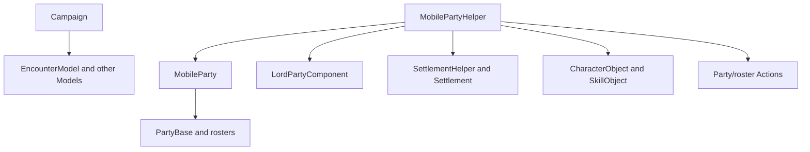

# MobilePartyHelper

**命名空间：** `Helpers`  
**模块：** `TaleWorlds.CampaignSystem`  
**类型：** `public static class MobilePartyHelper`  
**基类：** `System.Object`  
**源文件：** `bin/TaleWorlds.CampaignSystem/Helpers/MobilePartyHelper.cs`

## 一句话职责

这个静态类为 [MobileParty](../../campaign/MobileParty) 提供领主队伍创建、队伍成员筛选、经验与伤势处理、速度调节和 AI 位置判断；它不是 MobileParty 的所有权或销毁 API。

## 心智模型

`MobilePartyHelper` 混合了查询与有副作用的队伍工具。查询入口读取现有 [MobileParty](../../campaign/MobileParty)、[PartyBase](../../campaign/PartyBase)、`TroopRoster` 和 Campaign Model；`SpawnLordParty`、`CreateNewClanMobileParty`、`PartyAddSharedXp`、`WoundNumberOfNonHeroTroopsRandomlyWithChanceOfDeath`、`TryMatchPartySpeedWithItemWeight` 和 `FillPartyManuallyAfterCreation` 会写入世界或 roster。

它应被理解为原版 Campaign/AI/战斗流程使用的低层辅助，而不是“安全地改变队伍”的总入口：

- 要把英雄加入已有队伍，使用 [AddHeroToPartyAction](../../campaign-ext/AddHeroToPartyAction)；不要用创建新 MobileParty 的 helper 代替成员迁移。
- 要删除队伍、改变囚禁、开始遭遇或处理完整事件级联，使用 [DestroyPartyAction](../../campaign-ext/DestroyPartyAction)、[TakePrisonerAction](../../campaign-ext/TakePrisonerAction) 或战斗 Action。
- 队伍创建入口会依赖 `LordPartyComponent.CreateLordParty`、导航位置和当前 Model；它们不能在主菜单或 Campaign 加载前调用。

## 依赖图



| 依赖 | 作用与时机 |
| --- | --- |
| [MobileParty](../../campaign/MobileParty) 与 [PartyBase](../../campaign/PartyBase) | 提供位置、主队伍、成员/囚犯 roster、速度、士气和宿主关系；查询必须在对象仍 active 时进行。 |
| [Campaign](../../campaign/Campaign) | 创建队伍时读取 EncounterModel，AI 据点判断读取地图/Campaign 状态；`GetPlayerPrisonersPlayerCanSell` 还读取 Campaign behavior 的锁定数据。 |
| `LordPartyComponent` | `SpawnLordParty` 和 `CreateNewClanMobileParty` 的实际创建者；helper 不直接完成所有队伍初始化。 |
| [Settlement](../../campaign/Settlement) 与 `SettlementHelper` | 据点 GatePosition 用于出生；没有当前位置时 `CreateNewClanMobileParty` 用 `GetBestSettlementToSpawnAround` 或旧队伍位置寻找出生点。 |
| [CharacterObject](../../campaign/CharacterObject)、[Hero](../../campaign/Hero)、[TroopRoster](../../campaign/TroopRoster) | 领袖、技能筛选、升级经验、非英雄伤势和手动填充都依赖这些对象。 |
| [AddHeroToPartyAction](../../campaign-ext/AddHeroToPartyAction)、[DestroyPartyAction](../../campaign-ext/DestroyPartyAction) | 负责完整的成员迁移、队伍终结、事件和生命周期；helper 的局部 roster 写入不能替代它们。 |

## 主要入口与调用边界

### 创建与出生

| 入口 | 实际行为 | 使用边界 |
| --- | --- | --- |
| `SpawnLordParty(Hero, Settlement)` | 用 Settlement 的 `GatePosition` 调用 `LordPartyComponent.CreateLordParty`，以据点为出生上下文。 | 只用于确实要生成领主队伍的 Campaign 流程；不是把 Hero 加入现有队伍。 |
| `SpawnLordParty(Hero, CampaignVec2, float)` | 在指定位置和半径调用同一个 LordParty 创建流程；位置可来自旧队伍或可导航据点。 | 先验证位置有效、半径合理并处于活动 Campaign；错误位置会产生无地图主体的风险。 |
| `CreateNewClanMobileParty(Hero, Clan)` | 若 Hero 在据点则从该据点生成；若在主队伍/其他队伍则先从旧成员 roster 移除；没有有效位置时尝试附近据点，最后用 EncounterModel 的加入半径创建。v1.4.5 方法体没有读取 `clan` 参数。 | 这是完整“拆出新领主队伍”的原版辅助，不是一般加入队伍入口；调用前确认 Hero、旧 roster 和目标 Clan 语义。 |
| `ResumePartyEscortBehaviorDelegate` | 声明一个无参数的 escort 恢复回调类型；它不是一个可取得的 helper 实例或初始化方法。 | 只有在与原版 escort 流程相同的回调边界使用；不要自行构造假的队伍服务对象。 |

### 选择成员与队伍能力

| 入口 | 实际行为 | 注意事项 |
| --- | --- | --- |
| `GetHeroWithHighestSkill(MobileParty, SkillObject)` | 遍历成员 roster 中有 HeroObject 的角色，返回技能值严格最高的 Hero；没有符合者返回 null。 | 这是当前 roster 查询；不考虑职位、伤势或 Model 的完整角色分配资格。 |
| `GetStrongestAndPriorTroops(MobileParty, int, bool)` | 把成员 roster 展平并去掉 wounded，再按 Level 选择；重载接收已有 `FlattenedTroopRoster`。可选把 PlayerCharacter 放回结果，并优先保留不可转移的 Hero。 | 返回新的 dummy TroopRoster；不会从来源队伍扣兵。`maxTroopCount` 必须是非负的玩法输入。 |
| `GetMaximumXpAmountPartyCanGet(MobileParty)` | 对每个成员调用 `CanTroopGainXp`，累加达到任一升级目标所需的最大 XP 缺口。 | 是计算上限，不是实际可直接写入的 XP；升级条件和 roster 仍需由调用者处理。 |
| `CanPartyAttackWithCurrentMorale(MobileParty)` | 仅判断 `party.Morale > 0f`。 | 它不是完整的遭遇资格、伤势、兵力或敌对检查；开始战斗仍走 Encounter/Action 流程。 |

### XP、伤势与库存副作用

| 入口 | 实际行为 | 风险 |
| --- | --- | --- |
| `CanTroopGainXp(PartyBase, CharacterObject, out int)` | 检查 `UpgradeTargets`，从 owner roster 取该角色数量/当前 XP，并按每个升级目标计算最大缺口。 | `owner` 必须包含该角色且模板升级数据有效；否则可能得到错误索引或断言。 |
| `PartyAddSharedXp(MobileParty, float)` | 按各 troop 的可升级缺口比例分配 XP，逐个调用 `AddXpToTroopAtIndex`；XP 小于 1 或没有可升级单位时停止。 | 直接改变成员 roster XP。只在确实拥有这笔 XP 的 Campaign 流程中调用，避免重复奖励。 |
| `WoundNumberOfNonHeroTroopsRandomlyWithChanceOfDeath(TroopRoster, int, float, out int)` | 对每名非 Hero 单位随机决定死亡，先移除死亡数，再把剩余人数标记为 wounded。 | 直接改变 roster，且使用全局随机数；它不是 Hero 死亡 Action，也不处理完整战斗事件。 |
| `TryMatchPartySpeedWithItemWeight(MobileParty, float, ItemObject)` | 把目标速度下限设为 1，默认使用 `DefaultItems.HardWood`，最多 200 次增减物品来逼近当前速度。 | 会真实添加/移除 ItemRoster 中的物品，且不保证精确速度；不要把它当作只读 Model 或库存无关的调速器。 |
| `FillPartyManuallyAfterCreation(MobileParty, PartyTemplateObject, int)` | 清空成员 roster，按 PartyTemplateStack 的 min/max 和随机值填充，再循环修正到目标人数。 | 只适合新建且尚未交给玩法的队伍；对现有队伍调用会删除真实成员。 |

### AI、俘虏与据点

| 入口 | 实际行为 | 调用时机 |
| --- | --- | --- |
| `GetMainPartySkillCounsellor(SkillObject)` | 从 `PartyBase.MainParty` 选择未 wounded、技能值最高的 Hero，没有时回退到主队领袖。 | 只在当前 Campaign 有主队时调用；返回的是角色选择结果，不会设置角色。 |
| `GetCurrentSettlementOfMobilePartyForAICalculation(MobileParty)` | 优先返回 `CurrentSettlement`；没有时仅当 `LastVisitedSettlement` 与当前位置平方距离小于 1 才返回后者，否则返回 null。 | 这是 AI 近似上下文，不是永久位置；调用者必须处理 null。 |
| `GetPlayerPrisonersPlayerCanSell()` | 新建 dummy roster，从 `IViewDataTracker` 取得锁定 StringId，再复制主队 PrisonRoster 中未锁定的俘虏。 | 依赖当前 Campaign、主队和 ViewDataTracker；返回副本，出售仍应使用 [SellPrisonersAction](../../campaign-ext/SellPrisonersAction)。 |

## 真实示例：在当前 Campaign 查询主队 AI 上下文

示例从 `MobileParty.MainParty` 获取已注册队伍，再使用 helper 的真实 AI 近似入口；它不直接写 roster：

```csharp
using TaleWorlds.CampaignSystem;
using TaleWorlds.CampaignSystem.Party;
using TaleWorlds.CampaignSystem.Settlements;
using TaleWorlds.Core;

public static class MainPartyContext
{
    public static bool CanUseMainPartyForAttack(out Settlement nearbySettlement, out Hero bestTactician)
    {
        nearbySettlement = null;
        bestTactician = null;
        if (Campaign.Current == null || MobileParty.MainParty == null || !MobileParty.MainParty.IsActive)
        {
            return false;
        }

        MobileParty party = MobileParty.MainParty;
        nearbySettlement = MobilePartyHelper.GetCurrentSettlementOfMobilePartyForAICalculation(party);
        bestTactician = MobilePartyHelper.GetHeroWithHighestSkill(party, DefaultSkills.Tactics);
        return MobilePartyHelper.CanPartyAttackWithCurrentMorale(party);
    }
}
```

`nearbySettlement` 仍可能为 null；`CanPartyAttackWithCurrentMorale` 只表示士气为正，不代表战斗可以无条件开始。

## 风险与存档边界

- **Campaign 阶段：** 队伍创建、主队、Model、ViewDataTracker 和 Settlement 定位都依赖活动 Campaign。主菜单、Campaign 构造/销毁及读档早期不可调用。
- **队伍创建：** `SpawnLordParty` 和 `CreateNewClanMobileParty` 会注册地图实体、改变 Hero 所属 roster，并依赖有效位置。重复调用或在旧队伍清理前调用，可能留下重复领主、丢失成员或无效地图位置。
- **Roster 破坏：** `FillPartyManuallyAfterCreation` 会先清空 roster；`PartyAddSharedXp`、伤势随机处理和调速入口都会改变保存的成员/物品数据。不要在 UI 预览或重复 tick 中调用。
- **Action 边界：** helper 的局部修改不会完成加入队伍、囚禁、战斗、解散、销毁和事件级联。涉及 Hero 或队伍关系时，优先使用 [AddHeroToPartyAction](../../campaign-ext/AddHeroToPartyAction)、[TakePrisonerAction](../../campaign-ext/TakePrisonerAction) 和 [DestroyPartyAction](../../campaign-ext/DestroyPartyAction)。
- **AI 结果不是事实：** 近似 settlement、最高技能 Hero、正士气和最大 XP 都是调用时计算结果；不要跨 tick 或读档把它们当作永久状态。
- **存档对象：** 不要保存旧 MobileParty、PartyBase 或 roster 枚举。跨读档保存稳定 StringId，并在 Campaign 加载完成后重新取得并验证 `IsActive`、roster 和所属关系。

## 版本注记

本页按 v1.4.5 `Helpers/MobilePartyHelper.cs` 及其在 `HeroSpawnCampaignBehavior`、Recruitment、Hideout、AI、俘虏出售和 Companion 角色行为中的调用点书写。特别是 `CreateNewClanMobileParty` 的 `Clan` 参数在该版本方法体中未被读取；不要据此假设它会替调用者完成入 Clan 事件。

## 导航

- ↑ 父级：[System API](../)
- ↔ 同级：[MobileParty](../../campaign/MobileParty) · [PartyBase](../../campaign/PartyBase) · [Hero](../../campaign/Hero) · [Settlement](../../campaign/Settlement)
- 相关：[TroopRoster](../../campaign/TroopRoster) · [PartyComponent](../../campaign/PartyComponent) · [AddHeroToPartyAction](../../campaign-ext/AddHeroToPartyAction) · [DestroyPartyAction](../../campaign-ext/DestroyPartyAction) · [TakePrisonerAction](../../campaign-ext/TakePrisonerAction) · [战役路线图](../../../architecture/roadmap)
