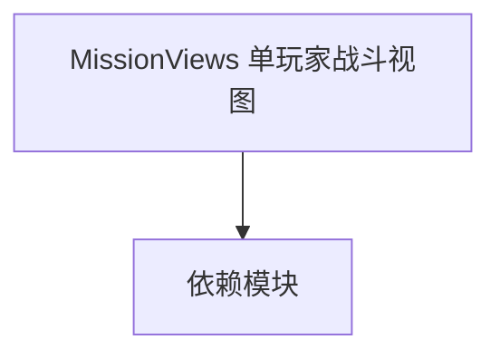

# MissionViews 单玩家战斗视图

**一句话职责：** 本页以家族索引形式覆盖 `MissionViews 单玩家战斗视图` 下全部 39 个业务类型，逐类给出命名空间、职责与典型时机，便于按模块而不是按字母表查阅。

## 心智模型

MissionViews 是战斗场景（Mission）的可视化层。每个 MissionView 派生类挂载到 Mission 上，订阅 Mission 事件并在每帧从游戏状态刷新表现（相机、特效、HUD 叠加）。它们与游戏逻辑解耦——视图只读取状态、不修改规则，便于单测与多端复用。

## 何时使用

在自定义战斗表现（如专属相机、定制特效、战场 HUD）时继承对应 MissionView 并注册到 Mission；不要在视图里写规则判定。

## 依赖关系

`MissionViews 单玩家战斗视图` 的类型依赖以下模块；缺其中任一都会导致编译或运行期失败。

- [Mission 战斗场景](../../mission/Mission)
- [MBSubModuleBase 模块入口](../../core/MBSubModuleBase)
- [View 视图总览](../_index)

## 类型清单

| Type | Namespace | Purpose | Timing |
| --- | --- | --- | --- |
| `CursorState` | TaleWorlds.MountAndBlade.View.MissionViews.Order | 视图层类型，负责场景或 UI 的呈现 | 战斗/任务加载时 |
| `OrderFlag` | TaleWorlds.MountAndBlade.View.MissionViews.Order | 视图层类型，负责场景或 UI 的呈现 | 战斗/任务加载时 |
| `OrderTroopPlacer` | TaleWorlds.MountAndBlade.View.MissionViews.Order | 战斗场景可视化视图，订阅 Mission 事件并在每帧刷新表现层 | 战斗/任务加载时 |
| `BallistaView` | TaleWorlds.MountAndBlade.View.MissionViews.SiegeWeapon | 视图层类型，负责场景或 UI 的呈现 | 战斗/任务加载时 |
| `BricoleView` | TaleWorlds.MountAndBlade.View.MissionViews.SiegeWeapon | 视图层类型，负责场景或 UI 的呈现 | 战斗/任务加载时 |
| `MangonelView` | TaleWorlds.MountAndBlade.View.MissionViews.SiegeWeapon | 视图层类型，负责场景或 UI 的呈现 | 战斗/任务加载时 |
| `RangedSiegeWeaponView` | TaleWorlds.MountAndBlade.View.MissionViews.SiegeWeapon | 场景可用装置，玩家交互时触发对应动作或菜单 | 战斗/任务加载时 |
| `RangedSiegeWeaponViewController` | TaleWorlds.MountAndBlade.View.MissionViews.SiegeWeapon | 战斗场景可视化视图，订阅 Mission 事件并在每帧刷新表现层 | 战斗/任务加载时 |
| `TrebuchetView` | TaleWorlds.MountAndBlade.View.MissionViews.SiegeWeapon | 视图层类型，负责场景或 UI 的呈现 | 战斗/任务加载时 |
| `BarterView` | TaleWorlds.MountAndBlade.View.MissionViews.Singleplayer | 战斗场景可视化视图，订阅 Mission 事件并在每帧刷新表现层 | 战斗/任务加载时 |
| `BoardGameView` | TaleWorlds.MountAndBlade.View.MissionViews.Singleplayer | 战斗场景可视化视图，订阅 Mission 事件并在每帧刷新表现层 | 战斗/任务加载时 |
| `DeploymentMissionView` | TaleWorlds.MountAndBlade.View.MissionViews.Singleplayer | 战斗场景可视化视图，订阅 Mission 事件并在每帧刷新表现层 | 战斗/任务加载时 |
| `DeploymentView` | TaleWorlds.MountAndBlade.View.MissionViews.Singleplayer | 战斗场景可视化视图，订阅 Mission 事件并在每帧刷新表现层 | 战斗/任务加载时 |
| `DeploymentVisualizationPreference` | TaleWorlds.MountAndBlade.View.MissionViews.Singleplayer | 视图层类型，负责场景或 UI 的呈现 | 战斗/任务加载时 |
| `FaceGeneratorMissionView` | TaleWorlds.MountAndBlade.View.MissionViews.Singleplayer | 战斗场景可视化视图，订阅 Mission 事件并在每帧刷新表现层 | 战斗/任务加载时 |
| `FormationIndicatorMissionView` | TaleWorlds.MountAndBlade.View.MissionViews.Singleplayer | 战斗场景可视化视图，订阅 Mission 事件并在每帧刷新表现层 | 战斗/任务加载时 |
| `Indicator` | TaleWorlds.MountAndBlade.View.MissionViews.Singleplayer | 视图层类型，负责场景或 UI 的呈现 | 战斗/任务加载时 |
| `MissionAgentLockVisualizerView` | TaleWorlds.MountAndBlade.View.MissionViews.Singleplayer | 战斗场景可视化视图，订阅 Mission 事件并在每帧刷新表现层 | 战斗/任务加载时 |
| `MissionBattleScoreUIHandler` | TaleWorlds.MountAndBlade.View.MissionViews.Singleplayer | 战斗场景可视化视图，订阅 Mission 事件并在每帧刷新表现层 | 战斗/任务加载时 |
| `MissionConversationView` | TaleWorlds.MountAndBlade.View.MissionViews.Singleplayer | 战斗场景可视化视图，订阅 Mission 事件并在每帧刷新表现层 | 战斗/任务加载时 |
| `MissionCustomBattlePreloadView` | TaleWorlds.MountAndBlade.View.MissionViews.Singleplayer | 战斗场景可视化视图，订阅 Mission 事件并在每帧刷新表现层 | 战斗/任务加载时 |
| `MissionDeploymentBoundaryMarker` | TaleWorlds.MountAndBlade.View.MissionViews.Singleplayer | 战斗场景可视化视图，订阅 Mission 事件并在每帧刷新表现层 | 战斗/任务加载时 |
| `MissionEntitySelectionUIHandler` | TaleWorlds.MountAndBlade.View.MissionViews.Singleplayer | 战斗场景可视化视图，订阅 Mission 事件并在每帧刷新表现层 | 战斗/任务加载时 |
| `MissionFormationMarkerUIHandler` | TaleWorlds.MountAndBlade.View.MissionViews.Singleplayer | 战斗场景可视化视图，订阅 Mission 事件并在每帧刷新表现层 | 战斗/任务加载时 |
| `MissionLeaveView` | TaleWorlds.MountAndBlade.View.MissionViews.Singleplayer | 战斗场景可视化视图，订阅 Mission 事件并在每帧刷新表现层 | 战斗/任务加载时 |
| `MissionMessageUIHandler` | TaleWorlds.MountAndBlade.View.MissionViews.Singleplayer | 战斗场景可视化视图，订阅 Mission 事件并在每帧刷新表现层 | 战斗/任务加载时 |
| `MissionOrderOfBattleUIHandler` | TaleWorlds.MountAndBlade.View.MissionViews.Singleplayer | 战斗场景可视化视图，订阅 Mission 事件并在每帧刷新表现层 | 战斗/任务加载时 |
| `MissionOrderUIHandler` | TaleWorlds.MountAndBlade.View.MissionViews.Singleplayer | 战斗场景可视化视图，订阅 Mission 事件并在每帧刷新表现层 | 战斗/任务加载时 |
| `MissionScoreUIHandler` | TaleWorlds.MountAndBlade.View.MissionViews.Singleplayer | 战斗场景可视化视图，订阅 Mission 事件并在每帧刷新表现层 | 战斗/任务加载时 |
| `MissionSiegeEngineMarkerView` | TaleWorlds.MountAndBlade.View.MissionViews.Singleplayer | 战斗场景可视化视图，订阅 Mission 事件并在每帧刷新表现层 | 战斗/任务加载时 |
| `MissionSingleplayerEscapeMenu` | TaleWorlds.MountAndBlade.View.MissionViews.Singleplayer | 战斗场景可视化视图，订阅 Mission 事件并在每帧刷新表现层 | 战斗/任务加载时 |
| `MissionSingleplayerKillNotificationUIHandler` | TaleWorlds.MountAndBlade.View.MissionViews.Singleplayer | 战斗场景可视化视图，订阅 Mission 事件并在每帧刷新表现层 | 战斗/任务加载时 |
| `MissionSpectatorControlView` | TaleWorlds.MountAndBlade.View.MissionViews.Singleplayer | 战斗场景可视化视图，订阅 Mission 事件并在每帧刷新表现层 | 战斗/任务加载时 |
| `PhotoModeView` | TaleWorlds.MountAndBlade.View.MissionViews.Singleplayer | 战斗场景可视化视图，订阅 Mission 事件并在每帧刷新表现层 | 战斗/任务加载时 |
| `SiegeDeploymentVisualizationMissionView` | TaleWorlds.MountAndBlade.View.MissionViews.Singleplayer | 战斗场景可视化视图，订阅 Mission 事件并在每帧刷新表现层 | 战斗/任务加载时 |
| `TutorialMissionViews` | TaleWorlds.MountAndBlade.View.MissionViews.Singleplayer | 视图层类型，负责场景或 UI 的呈现 | 战斗/任务加载时 |
| `MusicBattleMissionView` | TaleWorlds.MountAndBlade.View.MissionViews.Sound | 战斗场景可视化视图，订阅 Mission 事件并在每帧刷新表现层 | 战斗/任务加载时 |
| `MusicSilencedMissionView` | TaleWorlds.MountAndBlade.View.MissionViews.Sound | 战斗场景可视化视图，订阅 Mission 事件并在每帧刷新表现层 | 战斗/任务加载时 |
| `MusicStealthMissionView` | TaleWorlds.MountAndBlade.View.MissionViews.Sound | 战斗场景可视化视图，订阅 Mission 事件并在每帧刷新表现层 | 战斗/任务加载时 |

## 风险与边界

视图只读取状态、绝不写回规则；在 OnMissionTick 中做重活会拖帧，耗时操作应缓存或移出热路径。同名 MissionView 在单/多人分支可能分属不同派生类，跨端复用前先确认基类。

## 参见

- [Mission 战斗场景](../../mission/Mission)
- [MBSubModuleBase 模块入口](../../core/MBSubModuleBase)
- [View 视图总览](../_index)
