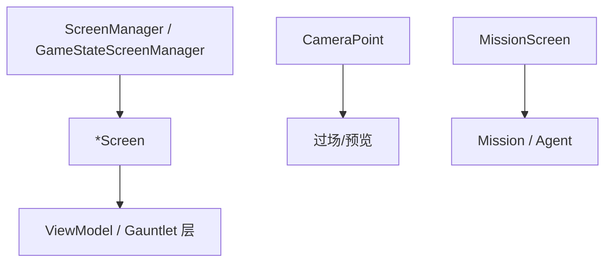

# Screens 家族手册

**一句话职责：** `TaleWorlds.MountAndBlade.View.Screens` 收纳游戏里「整屏界面宿主（Screen）」与相机锚点定义。`*Screen` 是 Gauntlet/原生 UI 的顶层容器（捏脸、旗帜编辑、设置、加载、过场、场景编辑、基准测试），`MissionScreen` 是任务进行时的 HUD 宿主，`CameraPoint` 系列定义过场/预览的相机机位。它们是 UI 的「舞台」，本身不含游戏逻辑，只承载对应 `ViewModel`/界面的生命周期。

## 心智模型

把一次界面切换想成「进入某个 Screen → 该 Screen 创建并持有 Gauntlet 层与 ViewModel → 退出时释放」。`GameStateScreenManager` 在游戏状态间切换对应 `GameStateScreen`；`MissionScreen` 在任务期间常驻并托管 HUD；`CameraPoint` 给过场/预览提供固定机位。阅读顺序：先看 [View 总索引](../../view/_index) 与 [GUI 总索引](../../gui/_index) 了解 UI 分层，再看 [MBSubModuleBase](../../core/MBSubModuleBase) 了解屏幕如何被注册，最后回到本页按「编辑 / 系统 / 任务 / 调试」找 Screen。

## 何时使用

- 你要新增一个整屏界面（如新编辑器/新菜单）——实现对应 `Screen` 并注册进 `ScreenManager`，不要直接在 Mission HUD 里堆功能。
- Screen 只管理 UI 生命周期；游戏状态变更应走战役层（`*Action`/Behavior）或对应 `ViewModel`，不要在 Screen 里写世界字段。
- 任务相关的 HUD 用 `MissionScreen`，不要在普通 Screen 里接管任务渲染。

## 依赖关系

- 上游：[MBSubModuleBase](../../core/MBSubModuleBase) 与 `ScreenManager` 注册并切换 Screen；[View 总索引](../../view/_index) 提供渲染设施。
- 下游：Screen 承载 [GUI 总索引](../../gui/_index) 的 Gauntlet 界面；`MissionScreen` 托管任务 HUD。
- 邻接模块：[mission-ext 总索引](../_index)。

## Screen 类型（TaleWorlds.MountAndBlade.View.Screens）

| Type | Namespace | Purpose | Timing |
| --- | --- | --- | --- |
| `BannerBuilderScreen` | TaleWorlds.MountAndBlade.View.Screens | 旗帜编辑界面，玩家自定义旗帜图案的 Gauntlet Screen。 | 旗帜编辑 |
| `BenchmarkScreen` | TaleWorlds.MountAndBlade.View.Screens | 性能基准测试界面，跑分并给出画质建议。 | 基准测试 |
| `CameraPoint` | TaleWorlds.MountAndBlade.View.Screens | 场景中的相机锚点，用于过场/预览相机定位。 | 过场/预览 |
| `CameraPointTestType` | TaleWorlds.MountAndBlade.View.Screens | 相机锚点测试类型枚举，测试不同机位。 | 视觉测试 |
| `CreditsScreen` | TaleWorlds.MountAndBlade.View.Screens | 制作人员/致谢界面。 | 菜单进入 |
| `FaceGeneratorScreen` | TaleWorlds.MountAndBlade.View.Screens | 角色捏脸界面，生成/编辑面部外观。 | 捏脸 |
| `GameLoadingScreen` | TaleWorlds.MountAndBlade.View.Screens | 游戏加载界面，显示进度与提示。 | 加载时 |
| `GameStateScreen` | TaleWorlds.MountAndBlade.View.Screens | 游戏状态界面（暂停/主菜单态对应的 Screen）。 | 状态切换 |
| `GameStateScreenManager` | TaleWorlds.MountAndBlade.View.Screens | 游戏状态界面管理器，在不同 GameState 间切换 Screen。 | 状态切换 |
| `IFaceGeneratorScreen` | TaleWorlds.MountAndBlade.View.Screens | 捏脸界面接口，定义 FaceGeneratorScreen 的契约。 | 捏脸 |
| `MissionScreen` | TaleWorlds.MountAndBlade.View.Screens | 任务（Mission）进行时的主界面，托管 HUD 的 Screen。 | 任务全程 |
| `OptionsScreen` | TaleWorlds.MountAndBlade.View.Screens | 设置界面（画质/音频/控制）。 | 设置打开 |
| `SceneEditorLayer` | TaleWorlds.MountAndBlade.View.Screens | 场景编辑器图层，编辑场景时的叠加层。 | 场景编辑 |
| `SceneEditorScreen` | TaleWorlds.MountAndBlade.View.Screens | 场景编辑器界面。 | 场景编辑 |
| `VideoPlaybackScreen` | TaleWorlds.MountAndBlade.View.Screens | 视频播放界面（过场/片头播放）。 | 视频播放 |
| `VisualTestsScreen` | TaleWorlds.MountAndBlade.View.Screens | 视觉测试界面，用于渲染/着色调试。 | 调试时 |

## 风险与边界

- **界面不写逻辑**：Screen 只管理 UI 生命周期；在这里改 `Hero`/`Settlement`/`MobileParty` 等会绕过实体不变量与存档边界。
- **生命周期配对**：Screen 进入/退出必须配对创建/释放 Gauntlet 层与 ViewModel，否则显存/内存泄漏或残留层挡住后续界面。
- **任务 HUD 归属**：任务期间的 HUD 必须走 `MissionScreen`，普通 Screen 不应接管任务渲染，否则 HUD 与任务状态脱节。
- **相机锚点失效**：`CameraPoint` 引用的场景对象销毁后机位失效，过场需判空避免空引用。

## 参见

- UI 分层：[View 总索引](../../view/_index)、[GUI 总索引](../../gui/_index)
- 模块与注册：[MBSubModuleBase](../../core/MBSubModuleBase)
- 任务运行：[Mission](../../mission/Mission)、[Agent](../../mission/Agent)
