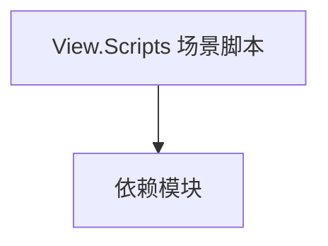

# View.Scripts 场景脚本

**一句话职责：** 本页以家族索引形式覆盖 `View.Scripts 场景脚本` 下全部 12 个业务类型，逐类给出命名空间、职责与典型时机，便于按模块而不是按字母表查阅。

## 心智模型

View.Scripts 提供挂载在场景 GameObject 上的脚本组件，是「数据/逻辑」与「场景表现」之间的桥。它们通常暴露可被 Gauntlet 或 MissionView 读取的运行时字段，并响应场景事件。多数脚本只负责把场景状态暴露出去，真正的决策仍由 Behavior/Model 完成。

## 何时使用

当某个场景物件需要在运行期被读取或驱动（如可交互摆设、表现锚点）时使用；不要在其中放业务规则。

## 依赖关系

`View.Scripts 场景脚本` 的类型依赖以下模块；缺其中任一都会导致编译或运行期失败。

- [Mission 战斗场景](../../mission/Mission)
- [View 视图总览](../_index)

## 类型清单

| Type | Namespace | Purpose | Timing |
| --- | --- | --- | --- |
| `BodyPartIndex` | TaleWorlds.MountAndBlade.View.Scripts | 视图层类型，负责场景或 UI 的呈现 | 界面打开时 |
| `CharacterDebugSpawner` | TaleWorlds.MountAndBlade.View.Scripts | 场景脚本组件，挂载到 GameObject 提供可重写逻辑 | 界面打开时 |
| `CharacterSpawner` | TaleWorlds.MountAndBlade.View.Scripts | 场景脚本组件，挂载到 GameObject 提供可重写逻辑 | 界面打开时 |
| `HandMorphTest` | TaleWorlds.MountAndBlade.View.Scripts | 场景脚本组件，挂载到 GameObject 提供可重写逻辑 | 界面打开时 |
| `HandPose` | TaleWorlds.MountAndBlade.View.Scripts | 场景脚本组件，挂载到 GameObject 提供可重写逻辑 | 界面打开时 |
| `InterpolationType` | TaleWorlds.MountAndBlade.View.Scripts | 视图层类型，负责场景或 UI 的呈现 | 界面打开时 |
| `MapColorGradeManager` | TaleWorlds.MountAndBlade.View.Scripts | 场景脚本组件，挂载到 GameObject 提供可重写逻辑 | 界面打开时 |
| `PathAnimationState` | TaleWorlds.MountAndBlade.View.Scripts | 视图层类型，负责场景或 UI 的呈现 | 界面打开时 |
| `PopupSceneCameraPath` | TaleWorlds.MountAndBlade.View.Scripts | 场景脚本组件，挂载到 GameObject 提供可重写逻辑 | 界面打开时 |
| `PopupSceneSequence` | TaleWorlds.MountAndBlade.View.Scripts | 场景脚本组件，挂载到 GameObject 提供可重写逻辑 | 界面打开时 |
| `PopupSceneSwitchCameraSequence` | TaleWorlds.MountAndBlade.View.Scripts | 视图层类型，负责场景或 UI 的呈现 | 界面打开时 |
| `PopupSceneSwitchItemSequence` | TaleWorlds.MountAndBlade.View.Scripts | 视图层类型，负责场景或 UI 的呈现 | 界面打开时 |

## 风险与边界

脚本组件依赖场景加载顺序，未就绪时访问字段会得到空值；不要在 Awake 之前假设依赖已注入。同一脚本在编辑器与运行期行为可能不同，需用宏隔离。

## 参见

- [Mission 战斗场景](../../mission/Mission)
- [View 视图总览](../_index)
