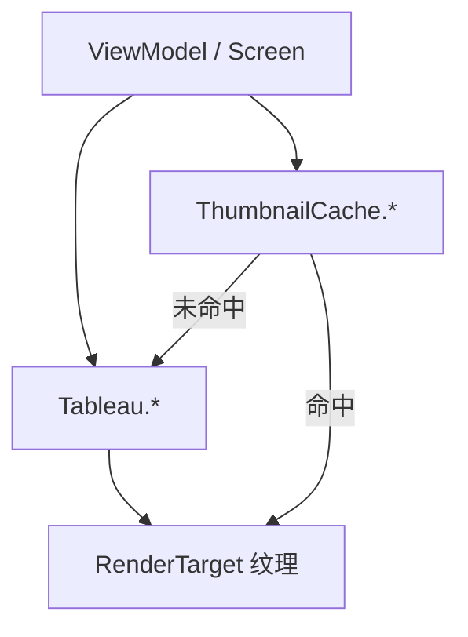

# Tableaus 与缩略图家族手册

**一句话职责：** `TaleWorlds.MountAndBlade.View.Tableaus`（及子命名空间 `Thumbnails`）是 Gauntlet UI 背后的「离屏渲染层」。Tableau 把角色、物品、横幅、场景等 3D 对象渲染进一张 `RenderTarget` 纹理，供界面元素直接显示并可旋转/缩放预览；Thumbnails 系列则缓存这些渲染结果，避免每次打开界面都重新渲染同一对象，是 UI 流畅度的关键。

## 心智模型

把 UI 里的「角色头像/物品图标/旗帜预览」想成两张图的配合：**Tableau** 负责「画一次」（把 3D 对象渲染到纹理），**ThumbnailCache** 负责「别重复画」（按来源数据缓存纹理并复用）。Tableau 通常由对应的 `Screen`/`ViewModel` 创建并持有 `RenderCallbackCollection` 驱动每帧更新；Thumbnail 系列在缓存未命中时才触发 Tableau 渲染，命中时直接返回纹理。阅读顺序：先看 [View 总索引](../../view/_index) 与 [GUI 总索引](../../gui/_index) 了解 UI 分层，再回到本页按「横幅 / 角色 / 物品 / 锻造」四组找对应缓存与创建数据。不要在 Tableau/缓存类里写游戏逻辑——它们只负责把已有数据画出来。

## 何时使用

- 你要在 UI 中显示可旋转的 3D 对象预览（角色、物品、旗帜、场景缩略）——用对应 Tableau。
- 同一对象会在多处/多次界面出现——用 ThumbnailCache 系列缓存纹理，降低 GPU 重复渲染开销。
- 不要在这些类里修改战役/战斗状态；它们只是表现层（presentation），输入数据来自 `ViewModel`/实体快照。

## 依赖关系

- 上游：[View 总索引](../../view/_index) 与 [GUI 总索引](../../gui/_index) 提供屏幕与 UI 宿主；`ViewModel` 提供待渲染的数据快照。
- 下游：渲染出的纹理被 Gauntlet 界面元素（头像、物品格、旗帜预览）消费。
- 邻接模块：[mission-ext 总索引](../../mission-ext/_index)（任务内相机预览共用渲染设施）。

## Tableau 类型（TaleWorlds.MountAndBlade.View.Tableaus）

| Type | Namespace | Purpose | Timing |
| --- | --- | --- | --- |
| `BannerTableau` | TaleWorlds.MountAndBlade.View.Tableaus | 在 UI 中把旗帜（Banner）渲染成可旋转的 3D 预览纹理的表帘。 | 旗帜界面打开/旋转 |
| `BannerTextureCreator` | TaleWorlds.MountAndBlade.View.Tableaus | 实际把旗帜网格渲染到 RenderTarget 纹理的创建器，被 BannerTableau 调用。 | 横幅渲染时 |
| `BannerThumbnailCreationBaseData` | TaleWorlds.MountAndBlade.View.Tableaus | 横幅缩略图创建数据基类（派生自 ThumbnailCreationData），承载横幅缩略纹理的通用创建参数。 | 创建纹理前 |
| `BasicCharacterTableau` | TaleWorlds.MountAndBlade.View.Tableaus | 渲染基础角色（无装备细节）到预览纹理的最小表帘实现。 | 角色预览 |
| `BrightnessDemoTableau` | TaleWorlds.MountAndBlade.View.Tableaus | 用于亮度/对比度演示的表帘，在设置或截图工具中预览光照。 | 光照演示 |
| `CharacterTableau` | TaleWorlds.MountAndBlade.View.Tableaus | 在 UI 中把角色（含装备）渲染成可旋转 3D 预览的表帘。 | 角色界面打开/旋转 |
| `ItemTableau` | TaleWorlds.MountAndBlade.View.Tableaus | 在 UI 中把物品（武器/护甲）渲染成 3D 预览纹理的表帘。 | 物品预览 |
| `RenderCallbackCollection` | TaleWorlds.MountAndBlade.View.Tableaus | 收集并管理一组表帘渲染回调，供宿主 UI 在帧上统一驱动渲染。 | 每帧更新 |
| `SceneTableau` | TaleWorlds.MountAndBlade.View.Tableaus | 把整个场景（战场缩略/据点预览）渲染到纹理的表帘。 | 场景预览 |
| `ThumbnailCacheManager` | TaleWorlds.MountAndBlade.View.Tableaus | 统一管理各类缩略图缓存（横幅/角色/物品）的创建与回收。 | 缓存初始化/释放 |
| `ThumbnailDebugUtility` | TaleWorlds.MountAndBlade.View.Tableaus | 缩略图系统调试辅助（显示缓存命中/纹理信息），用于排查渲染问题。 | 调试时 |

## 缩略图类型（TaleWorlds.MountAndBlade.View.Tableaus.Thumbnails）

| Type | Namespace | Purpose | Timing |
| --- | --- | --- | --- |
| `Alignment` | TaleWorlds.MountAndBlade.View.Tableaus.Thumbnails | 缩略图对齐枚举，定义纹理在目标区域内的对齐方式。 | 布局时 |
| `AvatarThumbnailCache` | TaleWorlds.MountAndBlade.View.Tableaus.Thumbnails | 缓存头像（Avatar）缩略纹理，避免重复渲染社交/英雄头像。 | 头像显示前查缓存 |
| `AvatarThumbnailCreationData` | TaleWorlds.MountAndBlade.View.Tableaus.Thumbnails | 头像缩略图创建所需的输入数据（来源/尺寸）。 | 创建纹理前 |
| `BannerDebugInfo` | TaleWorlds.MountAndBlade.View.Tableaus.Thumbnails | 横幅纹理调试信息结构（缓存键/尺寸），供调试工具读取。 | 调试时 |
| `BannerEditorTextureCache` | TaleWorlds.MountAndBlade.View.Tableaus.Thumbnails | 旗帜编辑器专用纹理缓存，复用编辑器内的横幅预览渲染。 | 编辑器预览 |
| `BannerEditorTextureCreationData` | TaleWorlds.MountAndBlade.View.Tableaus.Thumbnails | 旗帜编辑器纹理创建数据（编辑中的图案状态）。 | 创建纹理前 |
| `BannerPersistentTextureCache` | TaleWorlds.MountAndBlade.View.Tableaus.Thumbnails | 持久化横幅纹理缓存，跨界面复用而不随单次预览销毁。 | 跨界面复用 |
| `BannerTextureCreationData` | TaleWorlds.MountAndBlade.View.Tableaus.Thumbnails | 横幅纹理创建数据（颜色、纹章元素布局）。 | 创建纹理前 |
| `BannerThumbnailCache` | TaleWorlds.MountAndBlade.View.Tableaus.Thumbnails | 横幅缩略图缓存，复用横幅渲染结果以降低开销。 | 横幅显示前查缓存 |
| `BannerThumbnailCreationData` | TaleWorlds.MountAndBlade.View.Tableaus.Thumbnails | 横幅缩略图创建数据（面向缩略尺寸的图案参数）。 | 创建纹理前 |
| `CharacterThumbnailCache` | TaleWorlds.MountAndBlade.View.Tableaus.Thumbnails | 角色缩略图缓存，复用角色渲染结果以降开销。 | 角色显示前查缓存 |
| `CharacterThumbnailCreationData` | TaleWorlds.MountAndBlade.View.Tableaus.Thumbnails | 角色缩略图创建数据（角色/装备快照）。 | 创建纹理前 |
| `CraftingPieceCreationData` | TaleWorlds.MountAndBlade.View.Tableaus.Thumbnails | 锻造部件缩略图创建数据（部件网格引用）。 | 创建纹理前 |
| `CraftingPieceThumbnailCache` | TaleWorlds.MountAndBlade.View.Tableaus.Thumbnails | 锻造部件缩略图缓存，复用部件预览渲染。 | 部件显示前查缓存 |
| `ItemThumbnailCache` | TaleWorlds.MountAndBlade.View.Tableaus.Thumbnails | 物品缩略图缓存，复用物品渲染结果。 | 物品显示前查缓存 |
| `ItemThumbnailCreationData` | TaleWorlds.MountAndBlade.View.Tableaus.Thumbnails | 物品缩略图创建数据（物品/网格引用）。 | 创建纹理前 |
| `IThumbnailCache` | TaleWorlds.MountAndBlade.View.Tableaus.Thumbnails | 缩略图缓存统一接口，定义获取/释放纹理的契约。 | 缓存调用时 |
| `NodeComparer` | TaleWorlds.MountAndBlade.View.Tableaus.Thumbnails | 缩略图缓存节点的比较器，用于缓存字典的键排序与查找。 | 缓存查找 |
| `SourceTypes` | TaleWorlds.MountAndBlade.View.Tableaus.Thumbnails | 缩略图来源类型枚举，决定从哪个表帘/资源取图。 | 创建纹理前 |
| `TextureCreationInfo` | TaleWorlds.MountAndBlade.View.Tableaus.Thumbnails | 纹理创建信息（尺寸/格式/来源），被创建器消费。 | 创建纹理前 |
| `ThumbnailCache` | TaleWorlds.MountAndBlade.View.Tableaus.Thumbnails | 缩略图缓存基类/通用实现，管理纹理生命周期与引用计数。 | 缓存读写 |
| `ThumbnailCacheNode` | TaleWorlds.MountAndBlade.View.Tableaus.Thumbnails | 缩略图缓存中的单个节点（键值、纹理引用、引用计数）。 | 缓存内部 |
| `ThumbnailCreationData` | TaleWorlds.MountAndBlade.View.Tableaus.Thumbnails | 缩略图创建数据基类，承载通用创建参数（尺寸/来源）。 | 创建纹理前 |

## 风险与边界

- **表现层不写逻辑**：Tableau/缓存只负责把已有数据画出来；在这里修改 `Hero`/`ItemObject` 等会绕过实体不变量与存档边界。
- **纹理生命周期**：缓存纹理需在被 UI 释放时正确回收，否则会显存泄漏；`ThumbnailCacheNode` 的引用计数必须配对获取/释放。
- **缓存键一致性**：`SourceTypes`/创建数据必须稳定且唯一，键冲突会导致不同对象显示成同一张纹理（串图）。
- **渲染线程**：Tableau 渲染发生在渲染线程；从游戏线程直接读写纹理数据需走正确同步，避免竞态撕裂。

## 参见

- UI 分层：[View 总索引](../../view/_index)、[GUI 总索引](../../gui/_index)
- 任务内相机预览：[mission-ext 总索引](../../mission-ext/_index)
