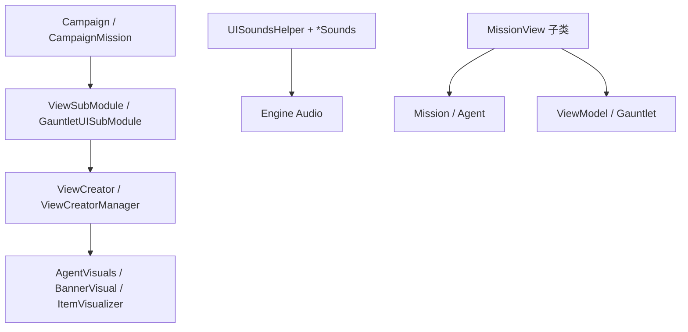

# 原生视图与任务视图家族手册

**一句话职责：** `TaleWorlds.MountAndBlade.View` 与 `TaleWorlds.MountAndBlade.View.MissionViews` 收纳引擎原生（Native）层的「渲染与表现」代码：从单位/旗帜/坐骑的三维可视化、各系统的音效常量、视图工厂与默认视图选择，到任务进行中挂在 Mission 上的各类 HUD 视图（MissionView）。它们是数据（Campaign/Mission）与屏幕之间的最后一公里，本身不持有游戏世界状态的真相，只负责把真相画出来。

## 心智模型

把一次游戏运行想成「游戏状态（Campaign/Mission 中的真相） → 视图层（把状态画出来、播出来）」。原生 View 模块里的类型分成几族：① 可视化对象（`*Visuals`/`*Visual`，如 `AgentVisuals`、`BannerVisual`）与它们的工厂（`*Creator`），由 `ViewSubModule` 在模块加载时注册；② 静态音效常量类（`*Sounds`、`UISoundsHelper`），按情境提供并播放音效；③ 视图选择 Attribute（`DefaultView`/`OverrideView`）与注册表（`ViewCreator`/`ViewCreatorManager`），决定某实体用哪个可视化；④ 任务内 HUD 视图（`MissionView` 子类，如 `MissionAgentLabelView`、`MissionCrosshair`、`MissionMainAgentController`），它们在 Mission 生命周期内订阅事件、读写 Mission/Agent 状态并刷新屏幕，但**不直接改写战役字段**。阅读顺序：先看 [ViewSubModule](../core/MBSubModuleBase) 与 [Mission](../mission/Mission) 了解视图如何被注册与挂载，再回本页按「可视化 / 音效 / 视图工厂 / 任务 HUD」四族找具体类；需要把结果显示成 Gauntlet 界面时，跳到 [ViewModel 总览](../viewmodel/)。

## 何时使用

- 你要改变的是「屏幕上看到/听到什么」（描边、标签、音效、淡入淡出、HUD），而不是游戏逻辑状态。
- 需要为实体挂可视化时，优先用已注册的 `*Creator`/`*Visual`，不要自己 new 网格；需要新行为时继承 `MissionView` 并只订阅关心的事件。
- 不要在 `MissionView` 里直接改 `Hero`/`Settlement`/`MobileParty` 的战役字段——任务结束应走 `*Action` 或 Behavior 事件，否则绕过存档与事件边界。

## 依赖关系

- 上游：[Mission](../mission/Mission)、[CampaignMission](../campaign-ext/CampaignMission) 与 [Agent](../mission/Agent) 提供状态；[MBSubModuleBase](../core/MBSubModuleBase) 提供注册入口。
- 下游：屏幕与音频由引擎消费；任务 HUD 通过 [ViewModel](../viewmodel/) 与 Gauntlet 层联动。
- 邻接模块：[视图模型总览](../viewmodel/)、[存档系统](../save-system/SaveManager)。

## 可视化对象与工厂（TaleWorlds.MountAndBlade.View）

| Type | Namespace | Purpose | Timing |
| --- | --- | --- | --- |
| `AgentVisuals` | TaleWorlds.MountAndBlade.View | 单位（Agent）的三维视觉表现，承载骨骼、装备与坐骑的可视化实例，是战场上“看到的单位”本身 | Agent 生成/换装时 |
| `AgentVisualsCreator` | TaleWorlds.MountAndBlade.View | `AgentVisuals` 的工厂，按 Agent 的装备、体型、坐骑数据拼装并实例化视觉对象 | 单位进入场景时 |
| `BannerVisual` | TaleWorlds.MountAndBlade.View | 旗帜（Banner）的三维可视化对象，渲染纹章与布料摆动 | 旗帜实体出现时 |
| `BannerVisualCreator` | TaleWorlds.MountAndBlade.View | `BannerVisual` 的工厂，按 Banner 数据生成旗帜网格与材质 | 旗帜创建时 |
| `BannerVisualExtensions` | TaleWorlds.MountAndBlade.View | 为 Banner/BannerVisual 提供扩展方法（取旗面、应用颜色），便于视图层快速操作旗帜视觉 | 视图层按需调用 |
| `CampaignSounds` | TaleWorlds.MountAndBlade.View | 大地图（Campaign）环境与界面音效常量集合，按城镇/村庄/海港等区域区分 | 进入对应地图区域时 |
| `ConversationTagView` | TaleWorlds.MountAndBlade.View | 对话场景中标记可交互 NPC/物体的视图标签，用于在对话镜头里高亮或定位目标 | 对话场景装配时 |
| `CraftedDataView` | TaleWorlds.MountAndBlade.View | 锻造界面中单条锻造数据的视图项（如部件预览卡片） | 打开锻造界面时 |
| `CraftedDataViewManager` | TaleWorlds.MountAndBlade.View | 管理 CraftedDataView 集合，按锻造数据变化刷新预览列表 | 锻造数据变动时 |
| `CraftingPieceCollectionElementViewExtensions` | TaleWorlds.MountAndBlade.View | 为锻造部件集合元素提供视图扩展，获取/刷新部件在 UI 中的可视化 | 锻造部件列表渲染时 |
| `CraftingSounds` | TaleWorlds.MountAndBlade.View | 锻造台相关音效常量（锤击、完成提示），由 UISoundsHelper 调度 | 锻造操作时 |
| `DefaultSounds` | TaleWorlds.MountAndBlade.View | 通用默认音效常量，作为各系统无特定音效时的兜底音 | 缺省音效回退时 |
| `DefaultView` | TaleWorlds.MountAndBlade.View | 自定义 Attribute，标记某类型使用默认视图（无需专属 View），供视图选择逻辑识别 | 视图注册/选择阶段 |
| `DLCInstallationQueryView` | TaleWorlds.MountAndBlade.View | 查询并展示 DLC 安装状态的视图，用于提示未安装内容 | 主菜单/内容检查阶段 |
| `EndgameSounds` | TaleWorlds.MountAndBlade.View | 结局/通关相关音效常量 | 战役结局演出时 |
| `IChatLogHandlerScreen` | TaleWorlds.MountAndBlade.View | 聊天日志展示屏契约：实现者需提供聊天日志的屏幕承载（联机聊天叠加用） | 联机/初始屏实现 |
| `InventorySounds` | TaleWorlds.MountAndBlade.View | 物品栏操作音效（开合、移动、装备），由 UISoundsHelper 调度 | 物品栏交互时 |
| `ISiegeDeploymentView` | TaleWorlds.MountAndBlade.View | 围城部署阶段视图契约，提供攻防双方部队布置的 UI 挂载点 | 围城部署界面 |
| `ItemCollectionElementViewExtensions` | TaleWorlds.MountAndBlade.View | 为物品集合元素（ItemRoster 项）提供视图扩展（图标、数量显示） | 物品列表渲染时 |
| `ItemObjectViewExtensions` | TaleWorlds.MountAndBlade.View | 为 ItemObject 提供视图扩展（获取网格、材质、装备槽可视化） | 物品可视化时 |
| `ItemVisualizer` | TaleWorlds.MountAndBlade.View | 场景脚本（ScriptComponentBehavior），在场景中为物品实体生成并维护其可视化表现（挂载 mesh） | 场景物品加载时 |
| `KingdomSounds` | TaleWorlds.MountAndBlade.View | 王国/派系相关界面与事件音效常量 | 王国界面/事件时 |
| `MissionPlayerToggledOrderViewEvent` | TaleWorlds.MountAndBlade.View | 玩家在任务中开关某个指令（order）时发出的视图层事件，供 HUD 订阅刷新 | 玩家切换指令时 |
| `MissionSounds` | TaleWorlds.MountAndBlade.View | 任务过程音效常量（开火、命中、冲锋），按战斗事件触发 | 任务事件触发时 |
| `MountVisualCreationOutput` | TaleWorlds.MountAndBlade.View | 坐骑视觉创建的输出结构，承载生成的坐骑 mesh/材质引用 | 坐骑视觉创建返回时 |
| `MountVisualCreator` | TaleWorlds.MountAndBlade.View | 坐骑视觉创建工具，按坐骑类型生成可视化实例 | 骑兵/坐骑生成时 |
| `MultiplayerSounds` | TaleWorlds.MountAndBlade.View | 多人模式专用音效常量 | 联机任务时 |
| `NotificationSounds` | TaleWorlds.MountAndBlade.View | 通知/提示音效（新任务、收到消息），由 UISoundsHelper 调度 | 弹出通知时 |
| `OrderOfBattleSounds` | TaleWorlds.MountAndBlade.View | 战前布阵（order of battle）界面音效常量 | 布阵界面操作时 |
| `OverrideView` | TaleWorlds.MountAndBlade.View | 自定义 Attribute，标记用指定视图覆盖默认选择，优先级高于 DefaultView | 视图选择阶段 |
| `PanelSounds` | TaleWorlds.MountAndBlade.View | 面板（UI 容器）开关与交互音效常量 | 面板显隐时 |
| `PartySounds` | TaleWorlds.MountAndBlade.View | 队伍相关界面与移动音效（行军、扎营） | 队伍界面/移动时 |
| `PopupSceneEmissionHandler` | TaleWorlds.MountAndBlade.View | 弹出场景（战利品/对话小场景）的粒子/自发光处理脚本 | 弹出场景渲染时 |
| `PopupSceneSkeletonAnimationScript` | TaleWorlds.MountAndBlade.View | 弹出场景里骨骼动画的驱动脚本，播放待机/交互动作 | 弹出场景动画时 |
| `PopupSceneSpawnPoint` | TaleWorlds.MountAndBlade.View | 弹出场景中实体（物品/角色）的生成锚点脚本 | 弹出场景装配时 |
| `PortSounds` | TaleWorlds.MountAndBlade.View | 海港/渡口相关环境音效常量 | 进入海港区域时 |
| `PreloadHelper` | TaleWorlds.MountAndBlade.View | 预加载助手，在场景/界面打开前预载资源（mesh、材质、音频）以减少卡顿 | 场景/界面预载阶段 |
| `SiegeSounds` | TaleWorlds.MountAndBlade.View | 围城战斗音效（撞击、爆破、登城）常量 | 围城事件时 |
| `SimpleSceneTestWithMission` | TaleWorlds.MountAndBlade.View | 调试用载体：带 Mission 的简单场景，用于离线验证任务/视图逻辑 | 调试/测试时 |
| `UISoundsHelper` | TaleWorlds.MountAndBlade.View | UI 音效播放助手，统一调度各 *Sounds 常量按情境选音 | 任一 UI 音效触发时 |
| `ViewCreator` | TaleWorlds.MountAndBlade.View | 视图创建工具，根据类型与上下文选择并实例化对应 View/Creator | 视图按需创建时 |
| `ViewCreatorManager` | TaleWorlds.MountAndBlade.View | 管理已注册的 ViewCreator，提供按类型查询工厂的注册表 | 视图系统初始化/查询时 |
| `ViewSubModule` | TaleWorlds.MountAndBlade.View | 视图子模块入口（MBSubModuleBase），注册各类 View/Creator、音效与默认视图选择规则 | 游戏启动/模块加载时 |
| `WeaponComponentViewExtensions` | TaleWorlds.MountAndBlade.View | 为武器部件（WeaponComponent）提供视图扩展（获取武器 mesh、附件可视化） | 武器可视化时 |

## 任务内 HUD 视图（TaleWorlds.MountAndBlade.View.MissionViews）

| Type | Namespace | Purpose | Timing |
| --- | --- | --- | --- |
| `MissionAgentContourControllerView` | TaleWorlds.MountAndBlade.View.MissionViews | 为单位渲染轮廓描边，高亮友军/敌军/可交互目标以提升战场可读性 | 战斗 HUD 高亮时 |
| `MissionAgentLabelView` | TaleWorlds.MountAndBlade.View.MissionViews | 在单位头顶渲染姓名/状态标签（血条、队伍色） | 单位显示时 |
| `MissionAgentStatusUIHandler` | TaleWorlds.MountAndBlade.View.MissionViews | 处理单位状态 UI（选中、受伤、死亡标记）的战斗界面处理器 | 战斗单位状态变化 |
| `MissionBattleUIBaseView` | TaleWorlds.MountAndBlade.View.MissionViews | 战斗 UI 视图抽象基类，封装战斗 HUD 的公共生命周期与事件订阅 | 战斗任务开始 |
| `MissionBoundaryCrossingView` | TaleWorlds.MountAndBlade.View.MissionViews | 检测并响应玩家/单位跨越任务边界（如脱离战斗区）的视图逻辑 | 边界穿越时 |
| `MissionBoundaryWallView` | TaleWorlds.MountAndBlade.View.MissionViews | 渲染任务边界墙（不可穿越区域的视觉阻挡），配合 BoundaryCrossing 提示 | 任务边界显示时 |
| `MissionCheatView` | TaleWorlds.MountAndBlade.View.MissionViews | 战斗内作弊指令视图抽象基类（无敌、瞬移），供调试与开发使用 | 调试/作弊开启时 |
| `MissionCrosshair` | TaleWorlds.MountAndBlade.View.MissionViews | 准星视图，渲染射击/瞄准十字光标并反馈命中 | 瞄准/射击时 |
| `MissionEscapeMenuView` | TaleWorlds.MountAndBlade.View.MissionViews | 任务中 Esc 菜单（暂停/退出/设置）的视图抽象基类 | 玩家按 Esc 时 |
| `MissionFaceCacheView` | TaleWorlds.MountAndBlade.View.MissionViews | 缓存并复用角色面部网格，避免重复生成面部可视化（性能优化） | 角色面部加载时 |
| `MissionFormationTargetSelectionHandler` | TaleWorlds.MountAndBlade.View.MissionViews | 编队目标选择处理器，让玩家框选/指定编队移动或攻击目标 | 编队指令下达时 |
| `MissionGamepadEffectsView` | TaleWorlds.MountAndBlade.View.MissionViews | 手柄震动/灯光等外设反馈视图（命中、冲刺反馈） | 手柄反馈触发时 |
| `MissionHintView` | TaleWorlds.MountAndBlade.View.MissionViews | 任务提示视图，在场景中标记可互动物或给出方向指引气泡 | 提示触发时 |
| `MissionItemContourControllerView` | TaleWorlds.MountAndBlade.View.MissionViews | 为场景物品（可拾取/可交互）渲染轮廓描边 | 物品高亮时 |
| `MissionMainAgentCheerBarkControllerView` | TaleWorlds.MountAndBlade.View.MissionViews | 控制主角周围单位的欢呼/喊话（cheer/bark）表现，增强演出 | 事件演出时 |
| `MissionMainAgentController` | TaleWorlds.MountAndBlade.View.MissionViews | 主角的输入与控制桥接，把玩家输入映射到主角 Agent 的移动/动作 | 任务全程（可控时） |
| `MissionMainAgentControlModeView` | TaleWorlds.MountAndBlade.View.MissionViews | 管理主角控制模式切换（自由/载具/指挥）并刷新对应 HUD | 控制模式切换时 |
| `MissionMainAgentEquipDropView` | TaleWorlds.MountAndBlade.View.MissionViews | 处理主角丢弃/拾取装备的视图反馈（掉落物生成） | 装备丢拾时 |
| `MissionMainAgentEquipmentControllerView` | TaleWorlds.MountAndBlade.View.MissionViews | 主角装备栏实时可视化控制，换装即时反映到模型 | 主角换装时 |
| `MissionMainAgentInteractionComponent` | TaleWorlds.MountAndBlade.View.MissionViews | 主角的交互组件，承载拾取/对话/使用等交互射线与命中处理 | 交互检测时 |
| `MissionObjectiveView` | TaleWorlds.MountAndBlade.View.MissionViews | 渲染任务目标标记（据点、护送点）与完成进度指示 | 目标更新时 |
| `MissionOptionsUIHandler` | TaleWorlds.MountAndBlade.View.MissionViews | 任务内选项/设置面板的视图处理器（画质、音量快速调整） | 打开任务内设置时 |
| `MissionPlayerMovementFlagsChangeEvent` | TaleWorlds.MountAndBlade.View.MissionViews | 玩家移动标志（行走/奔跑/潜行）变化事件，供视图层切换动画/音效 | 移动状态变化时 |
| `MissionViewsContainer` | TaleWorlds.MountAndBlade.View.MissionViews | 任务视图容器，聚合当前 Mission 的所有 MissionView 实例便于统一管理 | 任务视图注册/遍历时 |
| `OverrideMainAgentControlFlag` | TaleWorlds.MountAndBlade.View.MissionViews | 覆盖主角控制标志的枚举（锁定移动、锁定视角），供控制模式协商 | 控制协商时 |
| `ReplayCaptureLogic` | TaleWorlds.MountAndBlade.View.MissionViews | 战斗回放录制逻辑，捕获任务帧数据用于事后回放 | 回放录制时 |
| `ReplayMissionView` | TaleWorlds.MountAndBlade.View.MissionViews | 回放视图，按录制数据重现战斗并禁用实时输入 | 观看回放时 |
| `SpectatorCameraView` | TaleWorlds.MountAndBlade.View.MissionViews | 观战摄像机视图，在死亡/观战模式下提供自由/跟随摄像机 | 观战/死亡时 |

## 风险与边界

- **视图不持有真相**：`*Visuals`/`MissionView` 只读状态并绘制；在其中写 `Hero`/`Settlement` 战役字段会绕过 `*Action` 的事件、缓存与存档不变量，可能导致坏档或地图状态不一致。
- **MissionView 生命周期**：Agent 在任务结束/撤离后引用即失效；订阅 Agent 事件的视图必须在 `OnMissionEnd` 前退订，避免悬空回调。
- **视图注册顺序**：`ViewSubModule` 必须在模块加载阶段注册 `*Creator` 与 `*Visual`，否则运行时找不到可视化会抛异常或显示为默认体。
- **音效兜底**：各 `*Sounds` 仅是常数集合，真正播放统一走 `UISoundsHelper`；直接硬编码音频路径会破坏平台抽象。
- **性能**：`MissionFaceCacheView` 等缓存类旨在减少重复生成；自定义视图若每帧 new 网格会拖垮帧率。

## 参见

- 注册入口：[MBSubModuleBase](../core/MBSubModuleBase)、[Mission](../mission/Mission)
- 数据承载：[Agent](../mission/Agent)、[CampaignMission](../campaign-ext/CampaignMission)
- 界面绑定：[ViewModel 总览](../viewmodel/)、[存档系统](../save-system/SaveManager)
