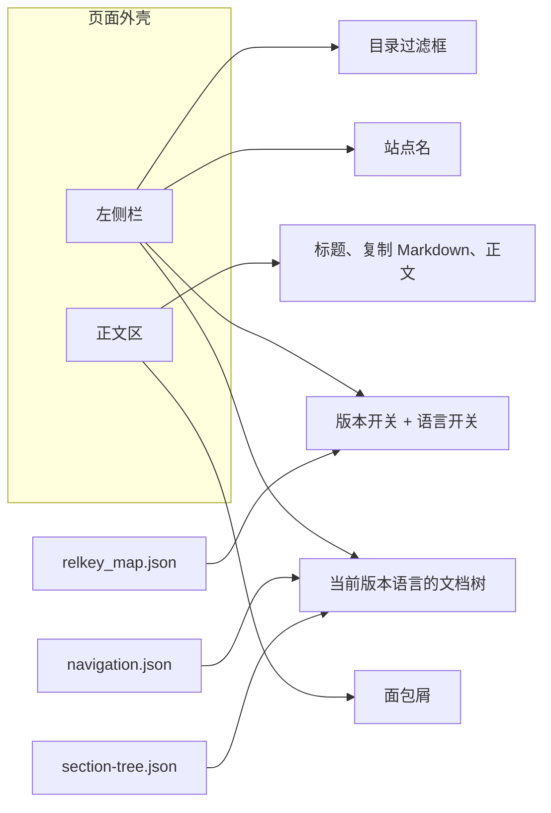

# 技术方案

## 架构

站点仍是 Zola 静态站。外壳只改模板、样式和一小段脚本，文档 Markdown 与 `data/navigation.json`、`data/section-tree.json`、`data/relkey_map.json` 的生成方式不变。

桌面：侧栏固定，正文在右侧滚动。窄屏（≤960px）：侧栏滑出，顶部一条只含菜单按钮和站点名的细栏。版本/语言面板默认收起，同时只展开一个；点击外部或 Escape 关闭，窄屏侧栏同样如此。

## 技术选型

| 项 | 选择 |
| --- | --- |
| 布局 | 改 `templates/base.html`。去掉顶栏里的栏目下拉。品牌、目录、开关都在侧栏 |
| 样式 | 新建 `static/shell.css`。`base.html` 里现有内联样式迁出，避免再把下拉面板写成始终可见 |
| 交互 | 新建 `static/shell.js`。只负责过滤、面板互斥、窄屏开关。链接在模板里算好 |
| 目录数据 | 继续用 `macros/sidebar.html` 读 JSON，不在模板里循环 `get_section()` |
| 搜索 | 侧栏过滤框只隐藏/显示当前文档树里的链接，匹配标题文本。不打开 `build_search_index` |

全文索引继续关闭：类页面数量在数万级，打开 Zola 搜索索引会把构建内存和产物体积拉高。过滤框解决「在当前这版目录里定位」；全文检索不在本次范围。

## 版本与语言怎么跳

沿用现在顶栏已经在用的相对路径键 `relkey`（去掉 `/v1.3.15/zh/` 这类前缀后的路径）和 `relkey_map.json`。

1. 当前页能在映射里找到目标版本 + 目标语言：用映射里的 URL。
2. 找不到：落到 `/{version}/{lang}/` 版本首页。
3. 站点首页、`/versions/` 没有 relkey：版本开关进入 `/{version}/{当前语言}/`；若该语言没有版本首页，改用该版本已有的语言首页。语言开关在这类页面上进入 `/v1.3.15/{所选语言}/`。

每个版本、每种语言在开关里只出现一次。当前项用 `aria-current="true"` 标出。

## 侧栏目录

版本语言树仍按 `navigation.json` 的分组渲染，标题用 `node.label[lang]`，子节标题用 `section-tree.json` 的 `title`。

同一路径只保留一个链接。现在「目录」和「全部 N 个页面」指向同一 URL，删掉后者；页数若需要，写在分组标题旁的文字里，不另做链接。

首页和 `/versions/`：侧栏列出首页、每个版本一次（链到该版本当前语言的首页）、跨版本比较。不再按中英文各放一条相同文案。

## 视觉

侧栏深色（约 280px），当前项用浅色条高亮。正文区浅灰底、白色阅读列，链接和焦点环用同一蓝色。分组用 `
`，当前路径上的分组默认展开。保留面包屑和复制 Markdown。外壳文案跟 `lang` 走。

## 改动文件

- `templates/base.html`：外壳结构，引用 `shell.css` / `shell.js`
- `templates/macros/sidebar.html`：目录、首页分支、版本/语言开关
- `templates/partials/topnav.html`：改为窄屏顶栏，或并入 `base.html` 后删除引用
- `static/shell.css`、`static/shell.js`：新建
- `templates/page.html`、`templates/section.html`：不改内容结构，除非标题行需要让出窄屏顶栏高度

不改 `content/**`、导航 JSON 和生成脚本。

## 测试

1. `zola build` 通过。
2. `node tools/audit-links.mjs` 的 `BROKEN_LINKS` 仍为 0。
3. 浏览器核对：`/v1.3.15/zh/` 下一篇类页的侧栏只含该语言树；切换版本和语言落到对应页或版本首页；关闭的面板不可见且不同时展开；首页侧栏每个版本一条；窄屏能打开和关闭侧栏。

## 安全性

纯静态页面。过滤框只读已渲染链接的文本并切换隐藏，不把输入写进 HTML。版本和语言的目标地址全部在构建时从现有 JSON 写出。
